# 🤖 Cyborg Coach: Your Generative Performance Engine

Tired of health apps that just show you data? Cyborg Coach is an open-source platform that turns your personal health data and curated knowledge into a personalized, evidence-based AI coach. 

It's built on a modern, multi-service Python stack and designed to be the "brain" that connects what you *know* (from books, articles, and expert advice) with what you *do* (your workouts, meals, and journal entries).

## ✨ Core Features (What's Working Today)

-   **🧠 Hybrid RAG Engine:** A sophisticated retrieval-augmented generation pipeline using Qdrant that combines semantic search over your personal journal with knowledge from curated documents (e.g., PDFs).
-   **🔄 Real-Time Indexing:** Journal entries created via the GraphQL API are automatically indexed into the vector database in the background by a Celery worker, making them immediately available for reflection.
-   **☁️ Cloud-Native Ingestion:** A secure, out-of-band ingestion pipeline for "tradition" knowledge bases. Upload PDFs to a GCS bucket, and a Cloud Function trigger tells the backend to process and index them automatically.
-   **🚀 Production-Ready Stack:** The entire system is containerized with Docker. A single `docker-compose up` command launches the FastAPI server, PostgreSQL, Qdrant, Redis, and Celery workers with healthchecks and persistent data.
-   **✅ Type-Safe GraphQL API:** A fully-featured API built with Strawberry for all interactions, including creating journal entries and performing semantic searches.

## 🏛️ Architecture

The system is designed as a distributed set of services, ready for a federated GraphQL architecture. The core logic lives in the API service, which orchestrates the database, task queue, and vector store.

```mermaid
graph TD
    subgraph "User / Triggers"
        A[📱 Mobile App / UI] --> B;
        C[☁️ GCS Cloud Function] --> B;
    end

    subgraph "Cyborg Coach Service Layer"
        B[🚪 FastAPI & GraphQL API] --> D{Unit of Work};
        B --> E{Celery Task Queue};

        D --> F[🐘 PostgreSQL];
        E --> G[🤖 Celery Worker];

        G --> D;
        G --> H[🧠 Qdrant];
        B --> H;
    end

    subgraph "Message Broker"
        E <--> I[♦️ Redis];
        G <--> I;
    end

    style F fill:#ccf,stroke:#333,stroke-width:2px
    style H fill:#f9f,stroke:#333,stroke-width:2px
```



## 🚀 Getting Started

**Prerequisites:** Docker and Docker Compose.

1.  **Clone the Repository**
    ```bash
    git clone <your-repo-url>
    cd librarian-ai
    ```

2.  **Set Environment Variables**
    Copy the example `.env` file. The defaults are configured for the local Docker environment.
    ```bash
    cp .env.example .env
    ```
    You will need to add your `OPENAI_API_KEY` to this file to enable the LLM features.

3.  **Launch the Stack**
    ```bash
    docker-compose up --build -d
    ```

4.  **Access the Applications**
    -   **GraphQL API**: [http://localhost:8000/graphql](http://localhost:8000/graphql)
    -   **Celery Monitoring (Flower)**: [http://localhost:5555](http://localhost:5555)
    -   **Vector DB Dashboard (Qdrant)**: [http://localhost:6333/dashboard](http://localhost:6333/dashboard)

## 🔧 Tech Stack

| Layer          | Technology                                                     |
| -------------- | -------------------------------------------------------------- |
| **API**        | FastAPI, Strawberry GraphQL                                    |
| **Database**   | PostgreSQL, SQLAlchemy (Async)                                 |
| **Vector Store**| Qdrant                                                        |
| **Task Queue** | Celery, Redis                                                  |
| **AI/RAG**     | LangChain, OpenAI / Ollama                                     |
| **Infra**      | Docker, Docker Compose                                         |
| **Testing**    | Pytest, Unittest Mocks                                         |

## 🔮 Future Vision: The Multi-Agent System

The current stable foundation is just the beginning. The next evolution, detailed in `README.vision.md`, is to transform the core logic into a collaborative **society of agents** using frameworks like AutoGen.

-   **Specialist Agents:** Instead of a single chain, a "swarm" of agents will each specialize in a single domain (e.g., `JournalAgent`, `KnowledgeAgent`), allowing for parallel, expert data retrieval.
-   **The `@tool` Decorator:** A key goal is to enable rapid development by allowing any function in the codebase to be turned into a tool for an agent with a simple `@tool` decorator.
-   **Evolving to Graph RAG:** The long-term plan is to augment the current stack with a Knowledge Graph (like Memgraph) to model and query the explicit relationships between journal entries, concepts, and external knowledge, unlocking a new level of deep reasoning.

---
This project is under active development. For a more detailed breakdown of the long-term vision and architectural planning, see `README.vision.md`.