# 🤖 Cyborg Coach: Your Generative Performance Engine

Tired of health apps that just show you data? Cyborg Coach is an open-source platform that turns your personal health data and curated knowledge into a personalized, evidence-based AI coach. 

It's built on a modern, multi-service Python stack and designed to be the "brain" that connects what you *know* (from books, articles, and expert advice) with what you *do* (your workouts, meals, and journal entries).

## ✨ Core Features (What's Working Today)

-   **🧠 Hybrid RAG Engine:** A sophisticated retrieval-augmented generation pipeline using Qdrant that combines semantic search over your personal journal with knowledge from curated documents (e.g., PDFs).
-   **🔄 Real-Time Indexing:** Journal entries created via the GraphQL API are automatically indexed into the vector database in the background by a Celery worker, making them immediately available for reflection.
-   **☁️ Cloud-Native Ingestion:** A secure, out-of-band ingestion pipeline for "tradition" knowledge bases. Upload PDFs to a GCS bucket, and a Cloud Function trigger tells the backend to process and index them automatically.
-   **🚀 Production-Ready Stack:** The entire system is containerized with Docker. A single `docker-compose up` command launches the FastAPI server, PostgreSQL, Qdrant, Redis, and Celery workers with healthchecks and persistent data.
-   **✅ Type-Safe GraphQL API:** A fully-featured API built with Strawberry for all interactions, including creating journal entries and performing semantic searches.

## 🏛️ Architecture

The system is designed as a distributed set of services, ready for a federated GraphQL architecture. The core logic lives in the API service, which orchestrates the database, task queue, and vector store.

```mermaid
graph TD
    subgraph "User / Triggers"
        A[📱 Mobile App / UI] --> B;
        C[☁️ GCS Cloud Function] --> B;
    end

    subgraph "Cyborg Coach Service Layer"
        B[🚪 FastAPI & GraphQL API] --> D{Unit of Work};
        B --> E{Celery Task Queue};

        D --> F[🐘 PostgreSQL];
        E --> G[🤖 Celery Worker];

        G --> D;
        G --> H[🧠 Qdrant];
        B --> H;
    end

    subgraph "Message Broker"
        E <--> I[♦️ Redis];
        G <--> I;
    end

    style F fill:#ccf,stroke:#333,stroke-width:2px
    style H fill:#f9f,stroke:#333,stroke-width:2px
```



## 🚀 Getting Started

**Prerequisites:** Docker and Docker Compose.

1.  **Clone the Repository**
    ```bash
    git clone <your-repo-url>
    cd librarian-ai
    ```

2.  **Set Environment Variables**
    Copy the example `.env` file. The defaults are configured for the local Docker environment.
    ```bash
    cp .env.example .env
    ```
    You will need to add your `OPENAI_API_KEY` to this file to enable the LLM features.

3.  **Launch the Stack**
    ```bash
    docker-compose up --build -d
    ```

4.  **Access the Applications**
    -   **GraphQL API**: [http://localhost:8000/graphql](http://localhost:8000/graphql)
    -   **Celery Monitoring (Flower)**: [http://localhost:5555](http://localhost:5555)
    -   **Vector DB Dashboard (Qdrant)**: [http://localhost:6333/dashboard](http://localhost:6333/dashboard)

## 🔧 Tech Stack

| Layer          | Technology                                                     |
| -------------- | -------------------------------------------------------------- |
| **API**        | FastAPI, Strawberry GraphQL                                    |
| **Database**   | PostgreSQL, SQLAlchemy (Async)                                 |
| **Vector Store**| Qdrant                                                        |
| **Task Queue** | Celery, Redis                                                  |
| **AI/RAG**     | LangChain, OpenAI / Ollama                                     |
| **Infra**      | Docker, Docker Compose                                         |
| **Testing**    | Pytest, Unittest Mocks                                         |

## 🔮 Milestone 5: The LangGraph-Powered Agent Kernel

The next evolution of Cyborg Coach is to build a robust agentic kernel. After careful consideration, the development will proceed in two distinct phases:

1.  **Phase 1 (This Milestone):** Use **LangGraph** to build the foundational, stateful workflows for core business domains. This is for creating reliable, testable, and deterministic "subroutines" that handle complex but well-defined tasks (e.g., "summarize my journal entries for the last two weeks" or "build me a workout for tomorrow").
2.  **Phase 2 (Future Vision):** Layer **AutoGen** on top as a master orchestrator for handling complex, open-ended user requests that require decomposing the problem into multiple steps that the underlying LangGraph workflows can solve.

This milestone focuses on Phase 1: building the LangGraph-powered agent kernel.

#### **Core Concept: Dynamic Tool Discovery via GraphQL Introspection**

The key to decoupling the agent from the tools remains the same. We will use the GraphQL Gateway as a dynamic tool registry.

1.  **Schema as a Tool-Manifest:** Any `Query` or `Mutation` in the federated schema can be a tool. The GraphQL `description` field is used as an LLM-friendly prompt explaining what the tool does and when it should be used.
2.  **The `@agentTool` Directive:** A custom directive (`@agentTool`) will be added to the Gateway to explicitly mark which schema fields are available to the agent, providing fine-grained, declarative control from within each microservice.
3.  **Introspection on Startup:** When the `AgentService` boots, it runs a GraphQL introspection query against the Gateway to fetch all fields marked with `@agentTool`.
4.  **Dynamic Tool Generation:** For each discovered field, the service generates a corresponding Python function in memory. This function is pre-configured to execute a GraphQL call against the Gateway.

#### **Integration with LangGraph: A Stateful Flowchart**

This dynamic toolset will be wielded by an agent defined as a state machine or "flowchart" using LangGraph.

*   **The State Object:** A central Pydantic model will define the `State` of the graph, containing things like the original user input, a list of steps to take, tool results, and the final response. This object is passed between all nodes.
*   **The Nodes:** Each node in the graph is a function that performs a specific task:
    *   **`plan_step`:** Takes the user input and the current state to decide which tool to call next.
    *   **`execute_tool`:** Calls the chosen tool (one of the dynamically generated GraphQL functions) and populates its result into the state object.
    *   **`synthesize_response`:** Generates the final user-facing answer once the plan is complete.
*   **The Edges:** Conditional edges connect the nodes, routing the flow of control based on the current state (e.g., looping to execute more tools or proceeding to the final response).

#### **TDD-Based Implementation Plan**

This architecture will be built using a Test-Driven Development approach.

1.  **[TEST] Step 1: Build the Agent's Front Door & Intent Router:**
    *   **Implement:** Create a new `/chat` HTTP endpoint in the `AgentService`. This will be the primary entry point for all agentic interactions.
    *   **Implement:** This endpoint will invoke a new LangGraph graph. The entry point node for this graph will be an **Intent Router**.
    *   **Test:** The router's job is to classify the user's raw input. Write unit tests to ensure that given a user query, the router correctly classifies it into categories like `simple_rag_query`, `journal_summary_request`, or `complex_planning_request`.
    *   **Assert:** The graph should branch to different, simple handler nodes based on the router's output.

2.  **[TEST] Step 2: Test GraphQL Introspection & Tool Generation:**
    *   Write unit tests to verify that the system can correctly query a mock GraphQL schema, filter for `@agentTool` fields, and generate callable Python functions that produce the correct GraphQL query strings.

3.  **[TEST] Step 3: Test LangGraph State & Nodes:**
    *   Write unit tests for each individual node in the graph. For the `plan_step` node, mock an LLM call and assert it produces the correct plan. For the `execute_tool` node, assert that it correctly calls the dynamic tool function with the right arguments from the state.

4.  **[TEST] Step 4: Test LangGraph Conditional Edges:**
    *   Write unit tests to verify the routing logic. Given a specific `State` (e.g., one where the plan is complete), assert that the graph correctly routes to the `synthesize_response` node.

5.  **[TEST] Step 5: Test Full Graph Flow (Integration):**
    *   Write an integration test that compiles the full LangGraph graph.
    *   Initiate the graph with a user prompt that requires tool use. Mock the LLM calls and the GraphQL client.
    *   Assert that the graph transitions through the correct sequence of nodes and that the final state contains the expected response.

## 🧠 Future Vision: The AutoGen Orchestrator

Once the foundational LangGraph workflows for core domains are built and tested, we will introduce **AutoGen** as a higher-level "CEO" agent.

This agent will be responsible for tackling complex, multi-domain user requests like:

> *"Plan me a workout and nutrition program based on my goals, the fact I'm trying to go vegetarian, and am training for a marathon but happen to have a right shoulder impingement."*

To solve this, the AutoGen orchestrator won't call the GraphQL tools directly. Instead, its "tools" will be the pre-built, reliable **LangGraph graphs**. It will decompose the user's request and invoke the `GraphRAG` graph, the `WorkoutPlanner` graph, and the `Nutrition` graph in sequence, synthesizing their outputs into a single, comprehensive plan.

This two-layer architecture provides the best of both worlds: the deterministic reliability of LangGraph for core processes and the emergent, conversational intelligence of AutoGen for high-level orchestration.

---
This project is under active development. For a more detailed breakdown of the long-term vision and architectural planning, see `README.vision.md`.