# 🧠 MindMirror: Your Generative Performance Engine

An open-source, AI-powered personal performance platform that transforms your journal entries and curated knowledge into personalized, evidence-based coaching. Built with a modern, distributed microservices architecture and designed to be the "brain" that connects what you *know* with what you *do*.

## 🚀 Why This Matters: Technical Innovation That Drives Business Value

<details>
<summary><strong>🚀 Enterprise-Grade AI Architecture with Consumer-First Experience
</strong></summary>

- **🧠 Hybrid RAG at Scale:** Production-ready retrieval-augmented generation combining personal data (journals) with curated knowledge bases, powered by Qdrant vector search and advanced semantic ranking
- **⚡ Real-Time Intelligence Pipeline:** Celery-orchestrated background processing automatically indexes every user interaction, making personal insights available for semantic search within seconds  
- **🌐 GraphQL Federation Mastery:** Hive-powered microservices architecture enabling independent scaling, deployment, and development cycles while maintaining type safety across the entire stack
- **🔄 Event-Driven Consistency:** Advanced CQRS patterns with Redis pub/sub ensure eventual consistency across distributed services while maintaining sub-200ms response times
- **🛡️ JWT-Native Security:** End-to-end authentication with Supabase RLS policies, middleware-based route protection, and secure service-to-service communication

**Differentiated AI Application Layer:**
- **📊 Context-Aware Personalization:** Unlike generic ChatGPT interfaces, every AI response incorporates user's historical journal data, goals, and selected knowledge traditions (Stoicism, Ayurveda, etc.)
- **🎯 Domain-Specific Intelligence:** LangGraph-powered agent workflows specifically designed for health, productivity, and performance optimization—not general conversation
- **🔗 Knowledge Graph Evolution:** Architected for progression from vector search to full knowledge graph reasoning, enabling complex multi-hop queries across personal and curated data
- **🤖 AutoGen Orchestration Ready:** Designed foundation for complex, multi-agent workflows that can decompose sophisticated user requests into coordinated action plans

**Production-Ready Technology Foundation:**
- **🐳 Cloud-Native by Design:** Full containerization with Docker Compose locally, architected for seamless Google Cloud Run deployment with OpenTofu IaC
- **📈 Horizontal Scale Architecture:** Each microservice independently scalable, with database sharding patterns and vector database clustering ready for 10M+ users
- **🔍 Enterprise Observability:** OpenTelemetry, Prometheus, Grafana, and Loki integration planned for full-stack monitoring, distributed tracing, and performance analytics
- **⚗️ LLM Provider Agnostic:** Supports both OpenAI and local Ollama deployments, with abstraction layer ready for Anthropic, Cohere, or proprietary model integration

**Massive Market Opportunity with Defensible Technical Moats:**
- **💰 $127B Wellness + $50B Productivity Software Market:** Intersection of two massive, growing markets with AI-native approach  
- **🏰 Data Network Effects:** Every user interaction strengthens the personalization engine, creating compound value that competitors can't replicate
- **🔒 Privacy-First Competitive Advantage:** Self-hosted deployment options and local LLM support address enterprise privacy concerns that SaaS-only competitors cannot
- **⚡ Technical Execution Velocity:** Modern stack enables 10x faster feature development compared to legacy wellness platforms

</details>

## 🚀 Experience MindMirror

**The fastest way to experience MindMirror is with our demo environment:**

### Prerequisites
Before you begin, make sure you have:
- **Docker & Docker Compose** (for containerized services)
- **Supabase Project** (for authentication and database)
- **OpenAI API Key** OR **Ollama** (for local LLM inference)
- **Git** (to clone the repository)

#### Supabase Setup
1. **Create a Supabase project** at [supabase.com](https://supabase.com)
2. **Get your project credentials** from Settings → API:
   - `NEXT_PUBLIC_SUPABASE_URL` - Your project URL
   - `NEXT_PUBLIC_SUPABASE_ANON_KEY` - Your project's anon/public key
   - `SUPABASE_SERVICE_ROLE_KEY` - Your service role key (for backend services)
3. **Enable Email Authentication** in Authentication → Settings
4. **Configure email templates** (optional) for a branded signup experience

### Quick Start
```bash
# 1. Clone the repository
git clone <repository-url>
cd librarian-ai

# 2. Set up environment variables
cp env.example .env
# Edit .env and add your OPENAI_API_KEY (or configure Ollama settings)

# 3. Launch the full stack
make demo

# 4. Access the application
# - Main UI: http://localhost:3001
# - GraphQL Gateway: http://localhost:4000/graphql
# - Streamlit UI: http://localhost:8501
# - API Monitoring: http://localhost:5555
```

**That's it!** The demo will launch a complete distributed system with:
- 🧠 **Agent Service** - AI reasoning and RAG engine
- 📖 **Journal Service** - Structured and freeform journaling
- 🌐 **Next.js Web App** - Modern, responsive frontend
- 🔗 **Hive Gateway** - Federated GraphQL API layer
- 🗂️ **Vector Database** - Qdrant for semantic search
- ⚡ **Task Queue** - Celery workers for background processing

## ✨ Core Features (What's Working Today)

-   **🧠 Hybrid RAG Engine:** A sophisticated retrieval-augmented generation pipeline combining semantic search over your personal journal with knowledge from curated documents (PDFs, articles).
-   **📝 Real-Time Journaling:** Structured journaling (Gratitude, Reflection) and freeform entries are automatically indexed into the vector database in real-time.
-   **🔄 Intelligent Indexing:** Journal entries created via the GraphQL API are automatically processed by Celery workers and made immediately available for semantic search.
-   **☁️ Knowledge Base Ingestion:** Secure upload and processing of PDFs and text files into tradition-specific knowledge collections.
-   **🚀 Microservices Architecture:** Distributed system of specialized services orchestrated through a federated GraphQL gateway.
-   **✅ Production-Ready Stack:** Fully containerized with Docker, complete with healthchecks, persistent data, and horizontal scaling capabilities.

## 🏛️ Architecture

MindMirror is built as a federated system of microservices, each specialized for a specific domain. The architecture supports both local development and cloud deployment with seamless scaling.

```mermaid
graph TB
    subgraph "User Layer"
        A[📱 Next.js Web App<br/>Port 3001] 
        B[🎯 Streamlit UI<br/>Port 8501]
    end

    subgraph "API Gateway Layer"
        C[🌐 Hive Gateway<br/>Port 4000<br/>Federated GraphQL]
    end

    subgraph "Core Services"
        D[🧠 Agent Service<br/>Port 8000<br/>AI & RAG Engine]
        E[📖 Journal Service<br/>Port 8001<br/>Journaling & History]
    end

    subgraph "Background Processing"
        F[⚡ Celery Workers<br/>Background Tasks]
        G[🌸 Flower<br/>Port 5555<br/>Task Monitoring]
    end

    subgraph "Data Layer"
        H[🐘 PostgreSQL<br/>Port 5432<br/>Relational Data]
        I[🧠 Qdrant<br/>Port 6333<br/>Vector Database]
        J[🔴 Redis<br/>Port 6379<br/>Task Queue]
    end

    A --> C
    B --> C
    C --> D
    C --> E
    
    D --> F
    E --> F
    F --> G
    
    D --> H
    D --> I
    D --> J
    E --> H
    E --> J
    F --> H
    F --> I
    F --> J

    style A fill:#e1f5fe,stroke:#01579b,stroke-width:2px
    style C fill:#f3e5f5,stroke:#4a148c,stroke-width:2px
    style D fill:#e8f5e8,stroke:#1b5e20,stroke-width:2px
    style E fill:#fff3e0,stroke:#e65100,stroke-width:2px
    style H fill:#fce4ec,stroke:#880e4f,stroke-width:2px
    style I fill:#f1f8e9,stroke:#33691e,stroke-width:2px
```



## 🌍 Live Deployment: Enterprise-Grade Cloud Architecture

**We haven't deployed MindMirror as a live SaaS application to avoid unnecessary infrastructure costs during development.** However, our architecture is production-ready and designed for enterprise-scale deployment. Here's exactly how we'd go live:

### Infrastructure as Code with OpenTofu

```hcl
# Complete Google Cloud deployment managed via GitHub Actions
module "mindmirror_production" {
  source = "./terraform/modules/mindmirror"
  
  # Auto-scaling microservices on Cloud Run
  services = {
    agent_service    = { min_instances = 2, max_instances = 100 }
    journal_service  = { min_instances = 2, max_instances = 50 }
    hive_gateway     = { min_instances = 3, max_instances = 20 }
  }
  
  # Managed databases with automatic failover
  postgres_config = {
    tier = "db-standard-4"
    high_availability = true
    automated_backup = true
  }
}
```

### Production Service Architecture

| **Component** | **Cloud Service** | **Scaling Strategy** | **Estimated Cost @ 10K Users** |
|---------------|-------------------|---------------------|--------------------------------|
| **Microservices** | Google Cloud Run | Auto-scale 0→100 instances | $800/month |
| **Vector Database** | Qdrant Cloud | Managed clusters with replication | $400/month |
| **Relational DB** | Cloud SQL (PostgreSQL) | Read replicas + automatic failover | $300/month |
| **Message Queue** | Cloud Pub/Sub | Serverless, pay-per-message | $50/month |
| **LLM Inference** | Ollama on GKE + GPU nodes | Horizontal pod autoscaling | $1,200/month |
| **CDN + Load Balancing** | Cloud Load Balancer + CDN | Global edge caching | $100/month |

### Advanced Observability Stack

**OpenTelemetry + Prometheus + Grafana + Loki Integration:**
```yaml
# Full-stack observability configuration
monitoring:
  tracing:
    - OpenTelemetry distributed tracing across all microservices
    - Custom spans for LLM calls, vector searches, and graph traversals
    - Performance monitoring with P95/P99 latency tracking
  
  metrics:
    - Prometheus metrics for service health, business KPIs
    - Custom gauges: active users, journal entries/day, AI query success rate
    - Real-time alerting via PagerDuty integration
  
  logging:
    - Structured JSON logging with Loguru across all services
    - Centralized log aggregation via Loki
    - Intelligent log sampling to reduce costs while maintaining visibility
  
  dashboards:
    - Real-time user engagement metrics
    - AI model performance and cost tracking  
    - Infrastructure health and auto-scaling triggers
```

### Deployment Pipeline Architecture

**GitHub Actions → OpenTofu → Multi-Environment Promotion:**


**Zero-Downtime Deployment Strategy:**
- **Blue/Green Deployments:** Instant rollback capability with traffic switching
- **Database Migrations:** Forward-compatible schema changes with automated rollback
- **Feature Flags:** LaunchDarkly integration for gradual feature rollouts
- **Health Checks:** Deep health monitoring including database connectivity, LLM availability

### Enterprise Security & Compliance

- **End-to-End Encryption:** TLS 1.3 in transit, AES-256 at rest
- **Identity Management:** Supabase Auth with SAML/OIDC for enterprise SSO
- **API Security:** Rate limiting, DDoS protection, WAF integration
- **Data Residency:** Configurable deployment regions for GDPR/SOC2 compliance
- **Audit Logging:** Immutable audit trails for all user data access

### Cost Optimization & Auto-Scaling

- **Intelligent Scaling:** Cloud Run services scale to zero during low usage
- **LLM Cost Management:** Request batching, response caching, intelligent routing between OpenAI/Ollama based on query complexity
- **Database Optimization:** Read replicas for geography-based routing, connection pooling with PgBouncer
- **Vector Search Efficiency:** Qdrant clustering with automatic index optimization

**Total Estimated Infrastructure Cost:** $2,850/month @ 10K active users (~$0.29 per user/month)

This architecture supports **linear scaling to 1M+ users** with automatic infrastructure provisioning and cost management. The combination of serverless services (Cloud Run, Pub/Sub) with managed databases ensures we only pay for actual usage while maintaining enterprise-grade reliability.

## 🔧 Tech Stack

| Layer          | Technology                                                     |
| -------------- | -------------------------------------------------------------- |
| **Frontend**   | Next.js 14, React, TailwindCSS, Apollo Client                |
| **API Gateway**| Hive (GraphQL Federation), Custom Directives                  |
| **Backend**    | FastAPI, Strawberry GraphQL, Python 3.11+                    |
| **Database**   | PostgreSQL, SQLAlchemy (Async)                                |
| **Vector Store**| Qdrant                                                        |
| **Task Queue** | Celery, Redis                                                  |
| **AI/RAG**     | LangChain, OpenAI / Ollama                                     |
| **Infra**      | Docker, Docker Compose                                         |
| **Testing**    | Pytest, Jest, React Testing Library                           |

---
This project is under active development. For a more detailed breakdown of the long-term vision and architectural planning, see `README.vision.md`.