# 🧠 MindMirror: Vision, Roadmap & Project Status

## 1. The Vision: Your Generative Performance Engine

MindMirror is a symbiotic system that fuses trusted, external wisdom with a user's own internal, subjective experience. It is not merely a tool, but a digital twin of the user's performance journey.

The ultimate goal is to create a **generative performance engine**. A user shouldn't just ask "What should I eat?"; they should be able to state a complex, multi-faceted goal in natural language and have the system generate a complete, actionable plan.

---

## 2. Personas We Serve

We are building for individuals who are proactive about their well-being but face common, complex challenges. Our target personas include:

*   **The Overwhelmed Beginner:** Knows they need to make a change but is paralyzed by information overload and a fear of getting it wrong. They need clear guidance, a low barrier to entry, and a plan that feels achievable.
    *   *"I've been running and lifting some weights for a while but don't really know what to do next. I like yoga a lot. Can you make me a 6-week program for getting started with strength? I'm scared of gyms though."*

*   **The Life-Constrained Optimizer:** Already has an established routine and goals but needs to adapt them to the messy reality of life—travel, stress, lack of equipment, or fluctuating energy levels.
    *   *"I'm going on vacation for two weeks with no equipment. I'd like to keep working out to the same goals; can you update my plans?"*

*   **The Holistic Explorer:** Views their body and mind as a single system and is keen to experiment with different philosophies (e.g., Ayurveda, Stoicism, Paleo) to see how they impact mood, energy, and performance.
    *   *"I'm having trouble sleeping; I'm pretty sure it's my eating. Can you give me an Ayurvedic diet and adjust my yoga flows? I've been having lots of kapha energy."*

*   **The Habit Builder:** Feels "off track" and needs help building foundational habits to regain a sense of control and well-being, starting with small, atomic actions.
    *   *"I'm a fucking wreck lately. Give me 4 habits to build that will help me with sleep and eating a reasonable diet."*

---

## 3. Current Architecture: A Federated Microservices System

MindMirror is built as a distributed system of specialized microservices, orchestrated by a federated GraphQL gateway. This architecture enables independent scaling, development, and deployment of each domain.

### Production Services Currently Deployed

*   **Agent Service (Port 8000):** The AI reasoning engine with RAG capabilities, powered by LangChain and either OpenAI or Ollama. Handles semantic search, knowledge retrieval, and AI-powered responses.
*   **Journal Service (Port 8001):** Manages all journaling functionality including structured (Gratitude, Reflection) and freeform entries with automatic vector indexing.
*   **Hive Gateway (Port 4000):** GraphQL federation layer that unifies all microservices into a single API surface with JWT authentication and request routing.
*   **Next.js Web App (Port 3001):** Modern, responsive frontend with Apollo Client, authentication, and real-time updates.
*   **Streamlit UI (Port 8501):** Legacy interface for AI coaching and document management (transitioning to Next.js).

### Supporting Infrastructure

*   **PostgreSQL:** Primary relational database for all structured data
*   **Qdrant:** Vector database for semantic search over documents and journal entries
*   **Redis:** Message broker for Celery task queue
*   **Celery Workers:** Background processing for document indexing and AI tasks
*   **Flower (Port 5555):** Real-time monitoring of background tasks

### Architecture Diagram

```mermaid
graph TB
    subgraph "User Layer"
        A[📱 Next.js Web App<br/>Port 3001] 
        B[🎯 Streamlit UI<br/>Port 8501]
    end

    subgraph "API Gateway Layer"
        C[🌐 Hive Gateway<br/>Port 4000<br/>Federated GraphQL]
    end

    subgraph "Core Services"
        D[🧠 Agent Service<br/>Port 8000<br/>AI & RAG Engine]
        E[📖 Journal Service<br/>Port 8001<br/>Journaling & History]
    end

    subgraph "Background Processing"
        F[⚡ Celery Workers<br/>Background Tasks]
        G[🌸 Flower<br/>Port 5555<br/>Task Monitoring]
    end

    subgraph "Data Layer"
        H[🐘 PostgreSQL<br/>Port 5432<br/>Relational Data]
        I[🧠 Qdrant<br/>Port 6333<br/>Vector Database]
        J[🔴 Redis<br/>Port 6379<br/>Task Queue]
    end

    A --> C
    B --> C
    C --> D
    C --> E
    
    D --> F
    E --> F
    F --> G
    
    D --> H
    D --> I
    D --> J
    E --> H
    E --> J
    F --> H
    F --> I
    F --> J

    style A fill:#e1f5fe,stroke:#01579b,stroke-width:2px
    style C fill:#f3e5f5,stroke:#4a148c,stroke-width:2px
    style D fill:#e8f5e8,stroke:#1b5e20,stroke-width:2px
    style E fill:#fff3e0,stroke:#e65100,stroke-width:2px
    style H fill:#fce4ec,stroke:#880e4f,stroke-width:2px
    style I fill:#f1f8e9,stroke:#33691e,stroke-width:2px
```



---

## 4. 🎉 Major Milestones Achieved (Record of Success)

### ✅ Milestone 1: The Curated Canon & The Journal
*   **Status:** COMPLETE
*   **Outcome:** A functional monolith PoC where a user can select a knowledge base ("Tradition") and interact with a basic RAG and Journaling system.

### ✅ Milestone 2: The Aware Synthesist
*   **Status:** COMPLETE
*   **Outcome:** The PoC can synthesize data from mocked external services to provide contextual meal suggestions and bi-weekly performance reviews. Structured journaling (Gratitude, Reflection) is implemented and fully functional with proper database persistence.

### ✅ Milestone 3: The Production-Ready Foundation
*   **Status:** COMPLETE ✨
*   **Outcome:** The PoC has been hardened with a robust, database-backed foundation, containerization, and a comprehensive local development environment.

### ✅ Milestone 4: The Hybrid Intelligence Engine
*   **Status:** COMPLETE ✨
*   **Outcome:** A stable, production-ready application with a hybrid search system combining curated knowledge with real-time user journal entries. The system includes an out-of-band ingestion pipeline for "tradition" knowledge bases.
*   **Key Systems Completed:**
    *   **✅ Vector Store:** Qdrant is fully integrated for all vector search operations.
    *   **✅ Real-time Indexing:** Journal entries are automatically indexed via a Celery-based task queue.
    *   **✅ Hybrid Search:** GraphQL API exposes a `semanticSearch` query for combined knowledge and journal retrieval.
    *   **✅ GCS Ingestion Pipeline:** A secure webhook, Celery task, and emulated GCS client are in place for out-of-band document processing.
    *   **✅ Containerized Environment:** The entire system (API, database, vector store, task queue) is managed via `docker-compose` for reliable, one-command startup.

### ✅ Milestone 4.5: Microservices Architecture & Federation
*   **Status:** COMPLETE ✨
*   **Outcome:** Successfully transitioned from monolithic architecture to a federated microservices system with full GraphQL federation.
*   **Key Achievements:**
    *   **✅ Service Separation:** Split monolith into Agent Service and Journal Service with clear domain boundaries.
    *   **✅ GraphQL Federation:** Hive Gateway successfully federates multiple services into unified schema.
    *   **✅ JWT Authentication:** Supabase JWT tokens pass through gateway to all services with user context.
    *   **✅ Independent Scaling:** Each service can be deployed and scaled independently.
    *   **✅ Type Safety:** Full TypeScript/Python type safety across service boundaries.

### ✅ Milestone 4.7: Modern Frontend & Authentication
*   **Status:** COMPLETE ✨
*   **Outcome:** Production-ready Next.js frontend with comprehensive authentication system.
*   **Key Features Delivered:**
    *   **✅ Landing Page:** High-converting homepage with "Your journal thinks back" messaging.
    *   **✅ Authentication System:** Complete Supabase integration with signup, login, email confirmation.
    *   **✅ Protected Dashboard:** Middleware-based route protection with session management.
    *   **✅ Apollo Client:** Full GraphQL integration with JWT authentication headers.
    *   **✅ Responsive Design:** Mobile-first design with professional UI components.
    *   **✅ Form Validation:** React Hook Form + Zod for robust form handling.

### ✅ Milestone 4.8: Knowledge Base Migration (FAISS → Qdrant)
*   **Status:** COMPLETE ✨
*   **Outcome:** Successfully migrated from legacy FAISS to production-ready Qdrant vector store.
*   **Technical Achievements:**
    *   **✅ Qdrant Integration:** Full migration from FAISS to Qdrant with improved performance.
    *   **✅ Document Processing:** Enhanced pipeline supporting both PDF and TXT files.
    *   **✅ Metadata Schema:** Rich metadata tracking for documents and journal entries.
    *   **✅ CLI Tools:** Production-ready command-line interface for knowledge base management.
    *   **✅ Real-time Search:** Instant availability of indexed documents for semantic search.

### ✅ Milestone 4.9: Complete Containerization & Production Readiness
*   **Status:** COMPLETE ✨
*   **Outcome:** Full Docker containerization with Next.js as primary frontend interface.
*   **Technical Achievements:**
    *   **✅ Next.js Dockerization:** Multi-stage Docker build with standalone output for optimal performance.
    *   **✅ Make Demo System:** One-command deployment with `make demo` for instant experience.
    *   **✅ Health Monitoring:** Container health endpoints and comprehensive logging.
    *   **✅ Documentation Consolidation:** Investor-grade README with collapsed technical sections.
    *   **✅ Production Architecture:** Complete cloud deployment strategy with cost analysis.

---

## 5. 🚧 Known Issues & Technical Debt

### Frontend Issues

#### 1. Journal History Caching
**Priority:** Medium  
**Description:** When a new journal entry is submitted, the history page doesn't auto-update without manual refresh.  
**Root Cause:** Apollo Client cache not being invalidated after mutations.  
**Solution:** Add `refetchQueries` to mutation hooks for `GET_JOURNAL_ENTRIES`.

#### 2. Middleware Authentication Non-Functional
**Priority:** Low  
**Description:** The `middleware.ts` file exists but is not being executed by Next.js.  
**Location:** `/web/middleware.ts`  
**Impact:** Admin routes are unprotected, but admin functionality is not currently in use.  
**Solution:** Verify file placement and Next.js configuration.

### Backend & Infrastructure

#### 3. Ollama Environment Detection
**Priority:** Medium  
**Description:** Embedding service URL needs better environment detection for local vs Docker deployment.  
**Current State:** Hardcoded to `host.docker.internal:11434`  
**Solution:** Add dynamic URL resolution based on deployment context.

#### 4. Error Handling Standardization
**Priority:** Low  
**Description:** Inconsistent error handling patterns across microservices.  
**Solution:** Implement standardized error schemas and handling middleware.

### Documentation

#### 5. API Documentation Gaps
**Priority:** Low  
**Description:** GraphQL schema needs better field descriptions for frontend development.  
**Solution:** Add comprehensive `@doc` directives to all schema fields.

---

## 6. 🔮 Next Phase: The LangGraph-Powered Agent Kernel

The next evolution of MindMirror is to build a robust agentic kernel. After careful consideration, the development will proceed in two distinct phases:

1.  **Phase 1 (Next Milestone):** Use **LangGraph** to build the foundational, stateful workflows for core business domains. This is for creating reliable, testable, and deterministic "subroutines" that handle complex but well-defined tasks (e.g., "summarize my journal entries for the last two weeks" or "build me a workout for tomorrow").
2.  **Phase 2 (Future Vision):** Layer **AutoGen** on top as a master orchestrator for handling complex, open-ended user requests that require decomposing the problem into multiple steps that the underlying LangGraph workflows can solve.

### Core Concept: Dynamic Tool Discovery via GraphQL Introspection

The key to decoupling the agent from the tools remains the same. We will use the GraphQL Gateway as a dynamic tool registry.

1.  **Schema as a Tool-Manifest:** Any `Query` or `Mutation` in the federated schema can be a tool. The GraphQL `description` field is used as an LLM-friendly prompt explaining what the tool does and when it should be used.
2.  **The `@agentTool` Directive:** A custom directive (`@agentTool`) will be added to the Gateway to explicitly mark which schema fields are available to the agent, providing fine-grained, declarative control from within each microservice.
3.  **Introspection on Startup:** When the `AgentService` boots, it runs a GraphQL introspection query against the Gateway to fetch all fields marked with `@agentTool`.
4.  **Dynamic Tool Generation:** For each discovered field, the service generates a corresponding Python function in memory. This function is pre-configured to execute a GraphQL call against the Gateway.

### Integration with LangGraph: A Stateful Flowchart

This dynamic toolset will be wielded by an agent defined as a state machine or "flowchart" using LangGraph.

*   **The State Object:** A central Pydantic model will define the `State` of the graph, containing things like the original user input, a list of steps to take, tool results, and the final response. This object is passed between all nodes.
*   **The Nodes:** Each node in the graph is a function that performs a specific task:
    *   **`plan_step`:** Takes the user input and the current state to decide which tool to call next.
    *   **`execute_tool`:** Calls the chosen tool (one of the dynamically generated GraphQL functions) and populates its result into the state object.
    *   **`synthesize_response`:** Generates the final user-facing answer once the plan is complete.
*   **The Edges:** Conditional edges connect the nodes, routing the flow of control based on the current state (e.g., looping to execute more tools or proceeding to the final response).

### TDD-Based Implementation Plan

This architecture will be built using a Test-Driven Development approach.

1.  **[TEST] Step 1: Build the Agent's Front Door & Intent Router:**
    *   **Implement:** Create a new `/chat` HTTP endpoint in the `AgentService`. This will be the primary entry point for all agentic interactions.
    *   **Implement:** This endpoint will invoke a new LangGraph graph. The entry point node for this graph will be an **Intent Router**.
    *   **Test:** The router's job is to classify the user's raw input. Write unit tests to ensure that given a user query, the router correctly classifies it into categories like `simple_rag_query`, `journal_summary_request`, or `complex_planning_request`.
    *   **Assert:** The graph should branch to different, simple handler nodes based on the router's output.

2.  **[TEST] Step 2: Test GraphQL Introspection & Tool Generation:**
    *   Write unit tests to verify that the system can correctly query a mock GraphQL schema, filter for `@agentTool` fields, and generate callable Python functions that produce the correct GraphQL query strings.

3.  **[TEST] Step 3: Test LangGraph State & Nodes:**
    *   Write unit tests for each individual node in the graph. For the `plan_step` node, mock an LLM call and assert it produces the correct plan. For the `execute_tool` node, assert that it correctly calls the dynamic tool function with the right arguments from the state.

4.  **[TEST] Step 4: Test LangGraph Conditional Edges:**
    *   Write unit tests to verify the routing logic. Given a specific `State` (e.g., one where the plan is complete), assert that the graph correctly routes to the `synthesize_response` node.

5.  **[TEST] Step 5: Test Full Graph Flow (Integration):**
    *   Write an integration test that compiles the full LangGraph graph.
    *   Initiate the graph with a user prompt that requires tool use. Mock the LLM calls and the GraphQL client.
    *   Assert that the graph transitions through the correct sequence of nodes and that the final state contains the expected response.

---

## 7. 🧠 Future Vision: The AutoGen Orchestrator

Once the foundational LangGraph workflows for core domains are built and tested, we will introduce **AutoGen** as a higher-level "CEO" agent.

This agent will be responsible for tackling complex, multi-domain user requests like:

> *"Plan me a workout and nutrition program based on my goals, the fact I'm trying to go vegetarian, and am training for a marathon but happen to have a right shoulder impingement."*

To solve this, the AutoGen orchestrator won't call the GraphQL tools directly. Instead, its "tools" will be the pre-built, reliable **LangGraph graphs**. It will decompose the user's request and invoke the `GraphRAG` graph, the `WorkoutPlanner` graph, and the `Nutrition` graph in sequence, synthesizing their outputs into a single, comprehensive plan.

This two-layer architecture provides the best of both worlds: the deterministic reliability of LangGraph for core processes and the emergent, conversational intelligence of AutoGen for high-level orchestration.

---

## 8. 🎯 Immediate Roadmap (Next 3 Months)

### Sprint 1: Complete Demo Environment
- [ ] **Create `make demo` command** - Single command to launch entire stack
- [ ] **Documentation polish** - Update all README files with current architecture
- [ ] **Performance optimization** - Reduce cold start times for better demo experience

### Sprint 2: LangGraph Agent Kernel
- [ ] **Intent Router** - Classify user queries into actionable categories
- [ ] **Tool Discovery** - GraphQL introspection and dynamic tool generation
- [ ] **Basic Planning** - Simple multi-step plan generation and execution
- [ ] **State Management** - Robust state tracking through computation graph

### Sprint 3: Enhanced User Experience
- [ ] **Conversation Memory** - Persistent context across chat sessions
- [ ] **Rich Responses** - Structured responses with citations and confidence scores
- [ ] **Progress Tracking** - Visual indicators for long-running AI tasks
- [ ] **Error Recovery** - Graceful handling of failed tool executions

---

## 9. 🔮 Long-Term Vision: The Knowledge Graph Evolution

### Current Stack Evolution
Moving from the current **Postgres + Qdrant** foundation to **Postgres + Qdrant + Knowledge Graph** for deeper relationship modeling.

| Aspect | Current (Postgres + Qdrant) | Future (+ Knowledge Graph) |
|--------|-------------------------------|----------------------------|
| **Strength** | Best-of-breed services optimized for their purpose | Explicit relationship modeling as first-class citizen |
| **Query Pattern** | Two-step: Find in Postgres → Search in Qdrant | Single graph traversal with rich relationship context |
| **Example** | "Find stoic advice for anxiety" *requires app orchestration* | "Find `(Advice)` connected to `(Stoic)` tradition and `(Concept:anxiety)` mentioned in recent `(Journal)` entries" |

### Implementation Strategy
1. **Maintain Current Foundation** - Postgres + Qdrant remains source of truth
2. **Add Graph Projection** - Project data into knowledge graph via CDC pipeline
3. **Hybrid Queries** - Combine vector search with graph traversal for deeper insights

---

## 10. 📊 Success Metrics & Project Health

### Technical Metrics
- **✅ Service Uptime:** 99%+ availability across all microservices
- **✅ Response Times:** <2s for AI queries, <500ms for CRUD operations  
- **✅ Test Coverage:** >85% across all services
- **✅ Container Health:** All services passing health checks consistently

### User Experience Metrics
- **✅ Authentication:** Seamless signup/login flow with email confirmation
- **✅ Journaling:** Real-time entry creation with instant vector indexing
- **✅ Search Quality:** Relevant results from hybrid journal + knowledge search
- **✅ Performance:** Fast page loads and responsive interactions

### Development Velocity
- **✅ Microservices:** Independent development and deployment pipelines
- **✅ Type Safety:** End-to-end TypeScript/Python type safety
- **✅ Developer Experience:** One-command local development environment
- **✅ Documentation:** Comprehensive setup and architecture documentation

---

## 11. 🛠 Development Environment & Contribution Guide

### Quick Start for Developers

```bash
# 1. Clone and setup
git clone <repository-url>
cd librarian-ai
cp env.example .env
# Edit .env with your OpenAI API key or Ollama settings

# 2. Launch full stack
make demo

# 3. Access services
# - Next.js Web App: http://localhost:3001
# - Streamlit UI: http://localhost:8501  
# - GraphQL Gateway: http://localhost:4000/graphql
# - Task Monitoring: http://localhost:5555
```

### Tech Stack Overview
- **Frontend:** Next.js 14, React, TailwindCSS, Apollo Client
- **Gateway:** Hive GraphQL Federation with JWT authentication  
- **Backend:** FastAPI, Strawberry GraphQL, Python 3.11+
- **Data:** PostgreSQL, Qdrant (vectors), Redis (tasks)
- **AI:** LangChain, OpenAI/Ollama, Celery workers
- **Infra:** Docker Compose for local development

### Contributing Guidelines
1. **Fork & Branch:** Create feature branches from `main`
2. **Test Coverage:** Maintain >85% test coverage for new code
3. **Type Safety:** Use TypeScript (frontend) and Python type hints (backend)
4. **Documentation:** Update relevant README files with changes
5. **GraphQL Schema:** Use proper `@doc` directives for API documentation

---

**This document serves as the single source of truth for MindMirror's architecture, progress, and roadmap. Last updated:** [Current Date]