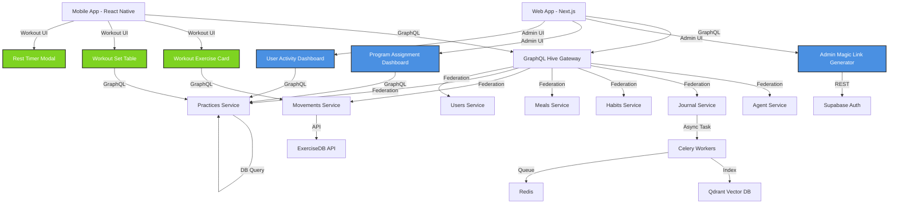

# MindMirror Brownfield Enhancement Architecture

**Document Version:** v4.0
**Last Updated:** 2025-10-15
**Architect:** Winston (Architect Agent)
**Status:** Active - Alpha Validation Enhancement

---

## Table of Contents

1. [Introduction](#1-introduction)
2. [Existing Project Analysis](#2-existing-project-analysis)
3. [Enhancement Scope and Integration Strategy](#3-enhancement-scope-and-integration-strategy)
4. [Tech Stack](#4-tech-stack)
5. [Data Models and Schema Changes](#5-data-models-and-schema-changes)
6. [Component Architecture](#6-component-architecture)
7. [API Design and Integration](#7-api-design-and-integration)
8. [External API Integration](#8-external-api-integration)
9. [Source Tree](#9-source-tree)
10. [Infrastructure and Deployment Integration](#10-infrastructure-and-deployment-integration)
11. [Coding Standards](#11-coding-standards)
12. [Testing Strategy](#12-testing-strategy)
13. [Security Integration](#13-security-integration)
14. [Next Steps](#14-next-steps)

---

## 1. Introduction

This document outlines the architectural approach for enhancing MindMirror with **Alpha Validation Infrastructure and Workout UI Polish**. Its primary goal is to serve as the guiding architectural blueprint for AI-driven development of new features while ensuring seamless integration with the existing system.

### Relationship to Existing Architecture

This document supplements existing project architecture by defining how new components will integrate with current systems. Where conflicts arise between new and existing patterns, this document provides guidance on maintaining consistency while implementing enhancements.

The enhancement focuses on **hardening existing functionality (85% built)** rather than greenfield development, preparing the voucher-based workout program infrastructure for real-world alpha user validation.

---

## 2. Existing Project Analysis

### 2.1 Current Project State

- **Primary Purpose:** AI-powered personal performance platform combining journal entries and curated knowledge bases using RAG (Retrieval-Augmented Generation) for personalized coaching
- **Current Tech Stack:** Federated GraphQL microservices (Python/FastAPI backend), React Native mobile app (Expo), Next.js web app, GraphQL Hive Gateway
- **Architecture Style:** Microservices with federated GraphQL, event-driven background processing (Celery)
- **Deployment Method:** Docker Compose (local/staging), Google Cloud Run (production target), Terraform IaC

### 2.2 Current Service Architecture

**Backend Services (FastAPI/Python):**
1. **Agent Service** (Port 8000) - AI conversation engine with LangGraph, RAG via Qdrant
2. **Journal Service** (Port 8001) - Structured journaling with automatic vector indexing
3. **Habits Service** (Port 8003) - Habit tracking and streaks
4. **Meals Service** (Port 8004) - Meal logging with Open Food Facts integration
5. **Movements Service** (Port 8005) - Exercise tracking with ExerciseDB API
6. **Practices Service** (Port 8006) - Meditation and mindfulness practices (workout programs)
7. **Users Service** (Port 8007) - User profiles and preferences

**Frontend Applications:**
- **Mobile App** (`mindmirror-mobile/`) - React Native with Expo, TypeScript + fp-ts, Apollo Client
- **Web App** (`web/`) - Next.js 15.3, Apollo Client, Supabase Auth, admin UI

**Infrastructure Services:**
- **GraphQL Gateway** (Port 4000) - Hive Gateway federating all microservice schemas
- **Celery Workers** - Background processing for journal indexing and document ingestion
- **Flower** (Port 5555) - Celery task monitoring UI

### 2.3 Database Architecture

**PostgreSQL Databases:**
- **Main DB** (Port 5432): Agent, Journal, Habits services
- **Movements DB** (Port 5435): Movements service (isolated)
- **Practices DB** (Port 5436): Practices service (isolated)
- **Users DB** (Port 5437): Users service (isolated)

**Vector Database:**
- **Qdrant** (Port 6333/6334): Semantic search over journals and knowledge bases, organized by "traditions"

**Cache/Queue:**
- **Redis** (Port 6379): Celery task queue and caching

### 2.4 Available Documentation

- **PRD** (`docs/prd.md`) - Alpha validation initiative requirements (v4)
- **CLAUDE.md** - Comprehensive project instructions for AI agents
- **User Stories** (`docs/stories/*.md`) - 14 detailed story specifications across 5 epics
- **Epics** (`docs/epics/*.md`) - 4 epic documents (Admin Tooling, Workout UI/UX, Infrastructure, Testing Framework)
- **Alpha Validation Strategy** (`docs/alpha-validation-week-1.md`, `docs/week-1-execution-checklist.md`)

### 2.5 Identified Constraints

1. **Deployment Constraint:** Current staging uses google_cloud_run_service (v1), needs migration to v2
2. **No Production Environment:** Staging environment shares Supabase with dev, unsuitable for real user data
3. **Manual Admin Operations:** Magic link generation requires CLI/SQL, no admin UI
4. **Mobile UI Polish Gap:** Workout execution UI functional but not "date-worthy" (alpha users would focus feedback on aesthetics)
5. **Testing Gap:** No reproducible test scripts for voucher flow validation
6. **No Error Tracking:** Unhandled exceptions not captured for alpha support
7. **Celery Dependency:** Current system uses Celery/Redis (future: migrate to GCP Pub/Sub post-validation)

### 2.6 Change Log

| Change | Date | Version | Description | Author |
|--------|------|---------|-------------|--------|
| Initial brownfield architecture creation | 2025-10-15 | v4.0 | Architecture document for alpha validation enhancement | Winston (Architect) |

---

## 3. Enhancement Scope and Integration Strategy

### 3.1 Enhancement Overview

**Enhancement Type:** Infrastructure hardening + UI/UX polish for existing system
**Scope:** 5 epics across 4-week alpha validation initiative
**Integration Impact:** Medium - Extends existing services, adds admin UI, production deployment, testing framework

### 3.2 Epic Breakdown

**Epic 1: Admin Tooling for Alpha Management** (2-4 hours)
- Extend existing web admin UI for magic link generation
- Add program assignment dashboard querying practices_service
- Enable test user account creation via Supabase Admin SDK

**Epic 2: Workout UI/UX Overhaul** (8-14 hours)
- Redesign React Native workout execution screens (exercise cards, set tables, rest timer)
- Clone Hevy app aesthetic for familiar fitness UX patterns
- Implement notes input for sets/exercises (practice_instance.notes field)
- Add visual polish (typography, spacing, animations)

**Epic 3: Production Infrastructure Hardening** (4-8 hours)
- Migrate Cloud Run services from v1 to v2 module (Terraform refactor)
- Provision separate Supabase production project with RLS policies
- Automate infrastructure bootstrapping (`make production-deploy` command)
- Implement secrets management via Google Secret Manager

**Epic 4: Alpha Testing Framework** (3-6 hours)
- Create manual test scripts for voucher flow (7-step validation)
- Set up E2E test framework (Detox or Maestro for React Native)
- Build alpha validation checklist (Google Sheets tracking)

**Epic 5: Alpha Monitoring & Support** (2-4 hours)
- Integrate GCP Error Reporting in mobile app
- Build user activity monitoring dashboard (admin UI)
- Document bug triage process (P0/P1/P2 severity levels)

### 3.3 Integration Approach

**Code Integration Strategy:**
- **Admin UI:** Extend existing `web/src/app/admin` structure, reuse GraphQL queries/mutations
- **Mobile UI:** Refactor existing workout screens in `mindmirror-mobile/app/(app)/client/`, preserve Apollo Client + Expo Router patterns
- **Infrastructure:** Migrate existing `infra/` Terraform modules to Cloud Run v2, maintain module-based architecture
- **Testing:** Add new test suites to existing Jest/React Native Testing Library setup

**Database Integration:**
- **No schema changes required** - All enhancement features use existing database fields
- Practices service `practice_instance.notes` field (confirmed exists) supports notes input
- Existing GraphQL mutations (`autoEnrollPractices`, `defer_practice`) support voucher flow

**API Integration:**
- **GraphQL Gateway:** No schema changes required, all mutations/queries exist
- **REST Endpoints:** Extend existing web API (`web/src/app/api/vouchers`) for magic link generation
- **Supabase Auth:** Leverage existing JWT authentication flow, no custom logic needed

**UI Integration:**
- **Mobile:** Replace existing workout screens with polished components, preserve navigation structure
- **Web:** Extend admin pages at `/admin/vouchers`, `/admin/programs`, `/admin/analytics`
- **Consistency:** Follow existing Gluestack UI (mobile) and Tailwind CSS (web) patterns

### 3.4 Compatibility Requirements

- **Existing API Compatibility:** All GraphQL queries/mutations backward compatible (no breaking changes)
- **Database Schema Compatibility:** Zero schema migrations required for enhancement (validate existing fields)
- **UI/UX Consistency:** Mobile app follows Expo Router patterns, web app follows Next.js App Router conventions
- **Performance Impact:** No degradation expected; Cloud Run v2 may improve cold start times

---

## 4. Tech Stack

### 4.1 Existing Technology Stack

| Category | Current Technology | Version | Usage in Enhancement | Notes |
|----------|-------------------|---------|---------------------|-------|
| **Backend Framework** | FastAPI | Latest | No changes | All 7 microservices use FastAPI |
| **Backend Language** | Python | 3.11+ | No changes | Async/await with SQLAlchemy |
| **API Gateway** | GraphQL Hive Gateway | Latest | Rebuild supergraph | Federates microservice schemas |
| **GraphQL Client** | Apollo Client | 3.13.8 | Extend queries | Mobile + web apps |
| **Mobile Framework** | React Native (Expo) | 53.0.22 | Workout UI refactor | Expo Router navigation |
| **Mobile Language** | TypeScript | 5.8.3 | Workout component development | fp-ts functional programming |
| **Mobile UI Library** | Gluestack UI | 1.1.73 | Component redesign | Pre-built accessible components |
| **Web Framework** | Next.js | 15.3.3 | Admin UI extensions | App Router pattern |
| **Web UI Library** | Tailwind CSS | 4.1.10 | Admin dashboard styling | Utility-first CSS |
| **Authentication** | Supabase Auth | 2.50.0 | Production project setup | JWT + magic links |
| **Database (Main)** | PostgreSQL | 15 | No changes | Agent, Journal, Habits |
| **Database (Services)** | PostgreSQL | 15 | No changes | Movements, Practices, Users |
| **Vector Database** | Qdrant | Latest | No changes | RAG for journals |
| **Cache/Queue** | Redis | 7 | No changes | Celery task queue |
| **Background Workers** | Celery | Latest | No changes | Journal indexing |
| **ORM** | SQLAlchemy | Latest (async) | No changes | Repository pattern |
| **Migrations** | Alembic | Latest | No changes (validate schemas) | Each service isolated |
| **Container Orchestration** | Docker Compose | Latest | Local/staging only | Not used in production |
| **Cloud Platform** | Google Cloud Run | v1 (staging) | **Migrate to v2** | Production deployment |
| **IaC** | Terraform | Latest | **Refactor modules** | Cloud Run v2 migration |
| **Storage** | GCS (Emulator local) | N/A | No changes | Prompt storage factory |
| **Testing (Mobile)** | Jest + React Native Testing Library | 29.6.3 | **Add E2E tests** | Detox or Maestro TBD |
| **Testing (Backend)** | pytest | Latest | No changes | Existing unit tests |
| **Linting (Mobile)** | ESLint + TypeScript | 8.57.1 | No changes | Expo lint config |
| **Linting (Backend)** | Ruff/Black | N/A | No changes | Python formatting |

### 4.2 New Technology Additions

| Technology | Version | Purpose | Rationale | Integration Method |
|-----------|---------|---------|-----------|-------------------|
| **Detox or Maestro** | Latest | React Native E2E testing | Automated regression tests for workout flow | Install via npm, integrate with Jest |
| **GCP Error Reporting SDK** | Latest | Mobile app error tracking | Lightweight alternative to Sentry for alpha | Install via npm, configure in app entry point |
| **Google Secret Manager** | N/A (GCP service) | Production secrets management | Secure API keys/credentials in Cloud Run | Mount secrets as volumes in Terraform |
| **Cloud Run v2** | N/A (Terraform module) | Modern serverless deployment | Improved cold starts, min instances, better logging | Replace `google_cloud_run_service` with `google_cloud_run_v2_service` |

---

## 5. Data Models and Schema Changes

### 5.1 Schema Integration Strategy

**Database Changes Required:**
- **New Tables:** None (all features use existing schemas)
- **Modified Tables:** None (validate existing fields support enhancement)
- **New Indexes:** None required for alpha (consider post-validation for performance)
- **Migration Strategy:** No migrations needed; validate existing schemas support all enhancement features

**Backward Compatibility:**
- All enhancement features use existing database fields and relationships
- No breaking changes to existing GraphQL schema or API contracts
- Existing data remains accessible and unmodified

### 5.2 Validated Existing Data Models

**Practices Service (`practice_instance` table):**
```python
# Confirmed in practices_service/practices/repository/models/practice_instance.py:37
notes: Mapped[Optional[str]] = mapped_column(String, nullable=True)
duration: Mapped[Optional[int]] = mapped_column(Integer, nullable=True)
completed_at: Mapped[Optional[datetime]] = mapped_column(DateTime, nullable=True)
date: Mapped[datetime] = mapped_column(DateTime, nullable=False)
```

**Usage in Enhancement:**
- `notes` field supports set-level and exercise-level notes (FR7: Notes Input)
- `duration` field supports workout timer persistence (FR9: Workout State Persistence)
- `completed_at` field supports workout completion tracking
- Historical `practice_instance` data queryable for "previous workout" comparison (FR5: Set Table)

**Vouchers Table (Supabase):**
- Existing schema supports magic link generation with embedded program_id
- Row-Level Security (RLS) policies will be enabled in production environment
- Email validation and expiration date fields already exist

**Users Table (Supabase):**
- Supabase Auth manages user accounts (no custom schema changes)
- Admin SDK supports test user creation without manual SQL

---

## 6. Component Architecture

### 6.1 New Components

#### 6.1.1 Admin Magic Link Generator Component

**Location:** `web/src/app/admin/vouchers/create/page.tsx`
**Responsibility:** Form UI for generating magic links with embedded vouchers
**Integration Points:**
- Reuses existing voucher API endpoint (`web/src/app/api/vouchers`)
- Queries practices_service GraphQL for program dropdown
- Validates email format and program existence client-side

**Key Interfaces:**
- `POST /api/vouchers/create` - Generates voucher and magic link
- GraphQL query `listPrograms` - Fetches available workout programs

**Dependencies:**
- **Existing Components:** Supabase Auth (admin role check), practices_service GraphQL
- **New Components:** None (standalone form component)

**Technology Stack:** Next.js 15 (Server Components), React Hook Form, Tailwind CSS, Zod validation

---

#### 6.1.2 Program Assignment Dashboard Component

**Location:** `web/src/app/admin/programs/page.tsx`
**Responsibility:** Display all workout programs and their enrollment status
**Integration Points:**
- Queries practices_service GraphQL for programs + enrollments
- Drill-down modal shows enrolled users per program

**Key Interfaces:**
- GraphQL query `listProgramsWithEnrollments` - Fetches programs + user counts
- GraphQL query `getProgramEnrollments(programId)` - Fetches enrolled users for specific program

**Dependencies:**
- **Existing Components:** practices_service GraphQL schema, Apollo Client
- **New Components:** EnrollmentDetailModal (sub-component)

**Technology Stack:** Next.js 15, Apollo Client, Tailwind CSS, Lucide React icons

---

#### 6.1.3 Workout Exercise Card Component

**Location:** `mindmirror-mobile/src/features/practices/components/ExerciseCard.tsx`
**Responsibility:** Display exercise name, GIF demo, target sets/reps with prominent visual hierarchy
**Integration Points:**
- Replaces existing exercise card in workout screen
- Queries ExerciseDB API (via movements_service) for GIF URLs
- Tappable GIF launches full-screen demo modal

**Key Interfaces:**
- GraphQL query `getExercise(id)` - Fetches exercise details including GIF URL
- Navigation to `ExerciseDetailModal` on GIF tap

**Dependencies:**
- **Existing Components:** movements_service GraphQL, Gluestack UI Card, ExerciseDB API
- **New Components:** ExerciseDetailModal (full-screen GIF viewer)

**Technology Stack:** React Native, TypeScript, Gluestack UI, React Native Reanimated (animations)

---

#### 6.1.4 Workout Set Table Component

**Location:** `mindmirror-mobile/src/features/practices/components/SetTable.tsx`
**Responsibility:** Clean, minimalist table for logging sets with previous/target/actual columns
**Integration Points:**
- Fetches historical practice_instance data for "previous workout" column
- Mutation `logSet(practiceInstanceId, setNumber, weight, reps, completed)` persists data
- Auto-advances focus from Weight → Reps → Next set weight

**Key Interfaces:**
- GraphQL query `getPreviousWorkout(exerciseId)` - Fetches last workout's sets
- GraphQL mutation `updatePracticeInstance` - Saves set data

**Dependencies:**
- **Existing Components:** practices_service GraphQL, Gluestack UI Input
- **New Components:** None (standalone table component)

**Technology Stack:** React Native, TypeScript, Gluestack UI Table, React Hook Form

---

#### 6.1.5 Rest Timer Modal Component

**Location:** `mindmirror-mobile/src/features/practices/components/RestTimerModal.tsx`
**Responsibility:** Prominent modal overlay with circular progress ring, countdown timer, Skip/Add 30s buttons
**Integration Points:**
- Triggers automatically after completing a set (checkbox checked)
- Haptic feedback at 10s, 5s, 0s remaining
- Background dimmed overlay prevents dismissal by tapping outside

**Key Interfaces:**
- React Native Modal API
- Expo Haptics API for feedback

**Dependencies:**
- **Existing Components:** Gluestack UI Modal, Expo Haptics
- **New Components:** CircularProgressRing (SVG-based progress indicator)

**Technology Stack:** React Native, TypeScript, Gluestack UI, React Native SVG, Expo Haptics

---

#### 6.1.6 User Activity Monitoring Dashboard Component

**Location:** `web/src/app/admin/analytics/page.tsx`
**Responsibility:** Display real-time alpha user engagement metrics
**Integration Points:**
- Queries practices_service for workout completion stats
- Aggregates data per-user: last login, workouts completed, completion rate
- Auto-refresh every 5 minutes

**Key Interfaces:**
- GraphQL query `getUserActivityMetrics` - Fetches per-user stats
- CSV export via client-side data transformation

**Dependencies:**
- **Existing Components:** practices_service GraphQL, Apollo Client
- **New Components:** None

**Technology Stack:** Next.js 15, Apollo Client, Tailwind CSS, Recharts (optional for visualizations)

---

### 6.2 Component Interaction Diagram



---

## 7. API Design and Integration

### 7.1 API Integration Strategy

**API Integration Strategy:** Extend existing GraphQL federation schema; add minimal REST endpoints for web admin
**Authentication:** Leverage existing Supabase JWT authentication (no custom JWT logic)
**Versioning:** No versioning required (backward-compatible extensions only)

### 7.2 New API Endpoints

#### 7.2.1 POST /api/vouchers/create

**Purpose:** Generate magic link with embedded voucher for program auto-enrollment
**Integration:** Extends existing `web/src/app/api/vouchers` endpoint

**Request:**
```json
{
  "email": "user@example.com",
  "programId": "uuid-of-workout-program",
  "expirationDate": "2025-11-15T00:00:00Z"
}
```

**Response:**
```json
{
  "success": true,
  "magicLink": "https://app.mindmirror.com/signup?voucher=abc123",
  "voucherId": "uuid-of-voucher",
  "expiresAt": "2025-11-15T00:00:00Z"
}
```

---

#### 7.2.2 GraphQL Extension: getUserActivityMetrics

**Purpose:** Fetch real-time alpha user engagement metrics
**Integration:** New query added to practices_service GraphQL schema

**Query:**
```graphql
query GetUserActivityMetrics($startDate: DateTime, $endDate: DateTime) {
  userActivityMetrics(startDate: $startDate, endDate: $endDate) {
    userId
    email
    lastLogin
    workoutsCompleted
    workoutCompletionRate
    averageSessionDuration
    notesAdded
    restTimerUsed
  }
}
```

**Response:**
```json
{
  "data": {
    "userActivityMetrics": [
      {
        "userId": "uuid",
        "email": "user@example.com",
        "lastLogin": "2025-10-15T08:30:00Z",
        "workoutsCompleted": 3,
        "workoutCompletionRate": 0.75,
        "averageSessionDuration": 1200,
        "notesAdded": 5,
        "restTimerUsed": 12
      }
    ]
  }
}
```

---

## 8. External API Integration

### 8.1 ExerciseDB API

**Purpose:** Fetch exercise GIF demos and metadata for workout cards
**Documentation:** https://v2.exercisedb.io
**Base URL:** https://v2.exercisedb.io
**Authentication:** API key (EXERCISEDB_API_KEY environment variable)
**Integration Method:** Proxy through movements_service GraphQL

**Key Endpoints Used:**
- `GET /api/v1/exercises/{exerciseId}` - Fetch exercise details including GIF URL
- `GET /api/v1/exercises/search?name={exerciseName}` - Search exercises by name

**Error Handling:**
- Retry failed requests with exponential backoff (max 3 retries)
- Fallback to placeholder thumbnail if GIF URL unavailable
- Cache successful responses in Redis (TTL: 24 hours)

---

## 9. Source Tree

### 9.1 Existing Project Structure

```
MindMirror/
├── src/                            # Backend microservices
│   ├── agent_service/              # AI conversation + RAG
│   ├── journal_service/            # Journaling
│   └── alembic-config/             # Database migrations
├── habits_service/                 # Habit tracking
├── meals_service/                  # Meal logging
├── movements_service/              # Exercise tracking
├── practices_service/              # Workout programs
├── users_service/                  # User profiles
├── celery-worker/                  # Background tasks
├── web/                            # Next.js admin/landing
├── mindmirror-mobile/              # React Native app
├── mesh/                           # GraphQL Gateway
├── infra/                          # Terraform IaC
├── cli/                            # MindMirror CLI tool
├── docs/                           # Project documentation
│   ├── prd.md
│   ├── epics/
│   └── stories/
├── docker-compose.yml
└── Makefile
```

### 9.2 New File Organization

```
MindMirror/
├── web/
│   ├── src/app/admin/
│   │   ├── vouchers/
│   │   │   └── create/
│   │   │       └── page.tsx             # NEW: Magic link generator
│   │   ├── programs/
│   │   │   └── page.tsx                 # NEW: Program dashboard
│   │   └── analytics/
│   │       └── page.tsx                 # NEW: Activity monitoring
│   └── src/app/api/vouchers/
│       └── create/
│           └── route.ts                 # EXTENDED: Voucher creation endpoint
├── mindmirror-mobile/
│   ├── src/features/practices/
│   │   └── components/
│   │       ├── ExerciseCard.tsx         # NEW: Exercise card redesign
│   │       ├── SetTable.tsx             # NEW: Set logging table
│   │       ├── RestTimerModal.tsx       # NEW: Rest timer modal
│   │       └── CircularProgressRing.tsx # NEW: Progress indicator
│   └── __tests__/
│       └── e2e/
│           └── workout-flow.spec.ts     # NEW: E2E test suite
├── infra/
│   └── modules/
│       ├── agent_service/
│       │   └── main.tf                  # MODIFIED: Cloud Run v2 migration
│       ├── journal_service/
│       │   └── main.tf                  # MODIFIED: Cloud Run v2 migration
│       ├── practices/
│       │   └── main.tf                  # MODIFIED: Cloud Run v2 migration
│       └── (all other services)          # MODIFIED: Cloud Run v2 migration
├── docs/
│   ├── architecture.md                  # NEW: This document
│   └── testing/
│       ├── voucher-flow-test-script.md  # NEW: Manual test script
│       └── bug-triage-process.md        # NEW: Alpha support process
└── Makefile
    └── (production-deploy target)        # NEW: One-command deployment
```

### 9.3 Integration Guidelines

- **File Naming:** Follow existing conventions (kebab-case for directories, PascalCase for React components)
- **Folder Organization:** Group by feature (`features/practices/`, `admin/vouchers/`)
- **Import/Export Patterns:** Use barrel exports (`index.ts`) for component directories

---

## 10. Infrastructure and Deployment Integration

### 10.1 Existing Infrastructure

**Current Deployment:** Docker Compose (local/staging), Cloud Run v1 (staging only)
**Infrastructure Tools:** Terraform, Google Cloud Platform, Supabase, Docker
**Environments:** Local (Docker), Staging (Cloud Run + Supabase), Production (not yet deployed)

### 10.2 Enhancement Deployment Strategy

**Deployment Approach:** Migrate all services to Cloud Run v2, provision separate production Supabase project, automate deployment via Makefile
**Infrastructure Changes:**
- Replace `google_cloud_run_service` with `google_cloud_run_v2_service` in all Terraform modules
- Add min_instances = 1 for practices_service (prevent cold starts during alpha)
- Configure startup/liveness probes for health checks
- Mount secrets via Google Secret Manager volumes (not environment variables)

**Pipeline Integration:**
- Extend Makefile with `make production-deploy` target
- Automate Terraform init → plan → apply → Supabase migrations
- Validate prerequisites (gcloud auth, Terraform installed, Supabase CLI)
- Output critical values: Gateway URL, Database connection strings, Supabase project URL

### 10.3 Rollback Strategy

**Rollback Method:** `make production-rollback` command reverts to previous Terraform state
**Risk Mitigation:**
- Test Cloud Run v2 migration in isolated GCP project first
- Maintain staging environment on Cloud Run v1 during production migration
- Keep rollback Terraform state in GCS backend
- Run migration during low-traffic window (alpha period has <3 users)

**Monitoring:**
- Cloud Run v2 logs centralized in GCP Logging (30-day retention)
- GCP Error Reporting captures unhandled exceptions from mobile app
- Flower UI monitors Celery task failures
- Health check endpoints: `/health` on all services

---

## 11. Coding Standards

### 11.1 Existing Standards Compliance

**Code Style:**
- **Python:** Black formatter, Ruff linter, async/await patterns
- **TypeScript:** ESLint + Expo config, fp-ts functional programming
- **React:** Functional components, hooks, composition over inheritance

**Linting Rules:**
- **Python:** Ruff with FastAPI best practices
- **TypeScript:** ESLint 8.57 with TypeScript plugin, Next.js config
- **Mobile:** Expo lint config (`@expo/eslint-config`)

**Testing Patterns:**
- **Python:** pytest with async fixtures, repository pattern unit tests
- **TypeScript:** Jest + React Native Testing Library, snapshot tests
- **E2E (NEW):** Detox or Maestro for mobile workflow automation

**Documentation Style:**
- Docstrings for Python functions (Google style)
- JSDoc for TypeScript public APIs
- Markdown for project documentation

### 11.2 Enhancement-Specific Standards

- **Admin UI Components:** Follow Next.js App Router patterns (Server Components by default, Client Components marked with "use client")
- **Mobile Workout Components:** Use Gluestack UI primitives, avoid custom styled-components
- **GraphQL Queries:** Co-locate queries with components (`*.graphql.ts` files)
- **Error Handling:** Use React Error Boundaries for UI errors, GCP Error Reporting for mobile app crashes

### 11.3 Critical Integration Rules

- **Existing API Compatibility:** Never modify existing GraphQL query/mutation signatures (only extend)
- **Database Integration:** Validate existing fields support new features before implementation (no schema changes)
- **Error Handling:** Wrap all external API calls (ExerciseDB, Supabase) in try/catch with fallback behavior
- **Logging Consistency:** Use existing FastAPI logging (Python) and console.error (TypeScript) patterns

---

## 12. Testing Strategy

### 12.1 Integration with Existing Tests

**Existing Test Framework:**
- **Backend:** pytest with async fixtures, SQLAlchemy test database
- **Mobile:** Jest 29.6.3 + React Native Testing Library, snapshot tests
- **Web:** Jest + Testing Library React, component unit tests

**Test Organization:**
- **Backend:** `tests/` directory per service, mirrors source structure
- **Mobile:** `__tests__/` at feature level, co-located with components
- **E2E (NEW):** `mindmirror-mobile/__tests__/e2e/` for Detox/Maestro

**Coverage Requirements:**
- **Backend:** 70% coverage minimum (existing services)
- **Mobile:** 60% coverage minimum (UI-heavy, harder to test)
- **NEW Components:** 80% coverage target (admin UI, workout components)

### 12.2 New Testing Requirements

#### 12.2.1 Unit Tests for New Components

**Framework:** Jest (mobile + web), pytest (backend)
**Location:**
- Mobile: `mindmirror-mobile/__tests__/features/practices/`
- Web: `web/__tests__/admin/`

**Coverage Target:** 80% line coverage for new components
**Integration with Existing:** Reuse existing test utilities (render helpers, mock Apollo Client, mock Supabase)

---

#### 12.2.2 Integration Tests

**Scope:**
- Verify admin magic link generation → Supabase voucher creation → GraphQL auto-enrollment flow
- Verify workout set logging → practice_instance mutation → data persistence
- Verify user activity metrics query → aggregated stats return

**Existing System Verification:**
- Run existing test suites to ensure no regressions
- Validate GraphQL gateway still composes all service schemas
- Confirm Celery tasks still index journal entries correctly

**New Feature Testing:**
- Mock ExerciseDB API responses in movements_service tests
- Mock Supabase Admin SDK in voucher creation tests
- Test error handling for failed API calls

---

#### 12.2.3 Regression Testing

**Existing Feature Verification:**
- Manual test script validates 7-step voucher flow (link generation → signup → workout completion)
- Edge cases: mismatched email, expired voucher, duplicate enrollment

**Automated Regression Suite (NEW):**
- E2E tests cover critical path: load workout → log sets → complete workout → rest timer appears
- Run on pre-push Git hook (prevent breaking changes from merging)

**Manual Testing Requirements:**
- PM executes manual test script before alpha invites
- Alpha validation checklist tracks user progress (Google Sheets)

---

## 13. Security Integration

### 13.1 Existing Security Measures

**Authentication:** Supabase JWT authentication (no custom JWT logic)
**Authorization:** Supabase Row-Level Security (RLS) policies on vouchers table
**Data Protection:** HTTPS only, secrets in Google Secret Manager
**Security Tools:** Dependabot (npm/pip), Supabase built-in RBAC

### 13.2 Enhancement Security Requirements

**New Security Measures:**
- Enable RLS policies on Supabase vouchers table (production environment)
- Reduce JWT expiry to 24 hours (vs 7 days in staging)
- Require email confirmation for signup (prevent typo-based account hijacking)
- Service accounts use least-privilege IAM roles (practices_service → only practices DB access)

**Integration Points:**
- Admin UI checks Supabase user role before rendering magic link generator
- Web API validates admin JWT before creating vouchers
- GraphQL mutations validate user ownership of practice_instance before updates

**Compliance Requirements:**
- GDPR: No PII logged in error reports (exclude email, names)
- Alpha user consent: Document bug reporting process, share privacy policy

### 13.3 Security Testing

**Existing Security Tests:** None (rely on Supabase RLS + JWT validation)
**New Security Test Requirements:**
- Test admin UI rejects non-admin users (role-based access control)
- Test voucher creation validates email format (prevent injection)
- Test GraphQL mutations reject unauthorized users (JWT validation)

**Penetration Testing:** Not required for alpha (3 users, invite-only); defer to Month 3 validation

---

## 14. Next Steps

### 14.1 Story Manager Handoff

**Prompt for Story Manager:**

You are working with the brownfield architecture document (`docs/architecture.md`) for the MindMirror alpha validation enhancement. This is an existing system with 85% of workout program infrastructure already built.

**Key Integration Requirements Validated:**
- All database fields exist (practice_instance.notes, duration, completed_at)
- GraphQL mutations validated (autoEnrollPractices, defer_practice)
- No schema changes required for any enhancement features
- Existing admin UI structure at `web/src/app/admin` can be extended

**Existing System Constraints:**
- Federated GraphQL architecture with 7 microservices
- Practices service uses separate PostgreSQL database (port 5436)
- Mobile app uses Expo Router + Gluestack UI (preserve navigation patterns)
- Web app uses Next.js 15 App Router + Tailwind CSS

**First Story to Implement:**
Start with **Story 1.1: Magic Link Generation UI** (docs/stories/1.1-magic-link-ui.md)

**Integration Checkpoints:**
1. Verify existing voucher API endpoint works (`web/src/app/api/vouchers`)
2. Confirm practices_service GraphQL query returns programs list
3. Test Supabase Admin SDK creates test users without errors
4. Validate magic link format matches expected pattern

**Maintain Existing System Integrity:**
- Do not modify existing GraphQL schemas (only extend)
- Preserve Supabase Auth flow (no custom JWT logic)
- Reuse existing Apollo Client configuration
- Follow existing file naming conventions (kebab-case directories)

---

### 14.2 Developer Handoff

**Prompt for Developers:**

You are implementing the MindMirror alpha validation enhancement. Reference this architecture document (`docs/architecture.md`) and existing coding standards analyzed from the project.

**Integration Requirements:**
- **GraphQL:** All queries/mutations already exist; no schema changes needed
- **Database:** Validate `practice_instance.notes` field exists before implementing notes input
- **Authentication:** Use existing Supabase JWT flow; admin role checks via `user.role === 'admin'`
- **Error Handling:** Wrap ExerciseDB API calls in try/catch with placeholder fallback

**Key Technical Decisions:**
- Cloud Run v2 migration: Replace `google_cloud_run_service` with `google_cloud_run_v2_service` in Terraform
- E2E testing: Choose Detox (more mature) vs Maestro (simpler setup) by Day 3
- Mobile animations: Use React Native Reanimated for smooth transitions
- Admin UI: Server Components by default, Client Components only when needed

**Existing System Compatibility Requirements:**
- Verify existing test suites pass after changes (`npm test`, `pytest`)
- Confirm GraphQL gateway still composes all service schemas (`make health`)
- Test voucher flow end-to-end before alpha invites (manual test script)
- Check mobile app builds on iOS + Android without errors

**Clear Sequencing:**
1. **Week 1 Days 1-2:** Epic 1 (Admin Tooling) - extends web admin UI
2. **Week 1 Days 1-5:** Epic 2 (Workout UI/UX) - refactors mobile components
3. **Week 1 Day 3:** Epic 4 subset (manual test script) - validates voucher flow
4. **Week 2 Days 1-3:** Epic 3 (Infrastructure) - Cloud Run v2 migration + production deployment
5. **Week 2-3:** Epic 4 completion (E2E tests) + Epic 5 (monitoring)

**Risk Minimization:**
- Test Cloud Run v2 migration in isolated GCP project first
- Keep staging on Cloud Run v1 during production migration
- Run full manual test script before sending alpha invites
- Enable GCP Error Reporting on Day 1 of alpha to catch crashes immediately

---

**End of Architecture Document**

*Generated by Winston (Architect Agent) on 2025-10-15*
*Based on PRD v4, CLAUDE.md, and comprehensive brownfield analysis*
