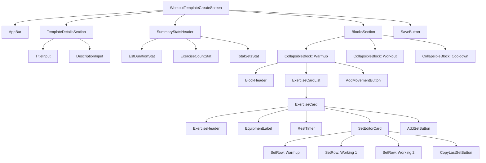
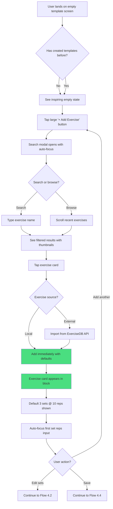
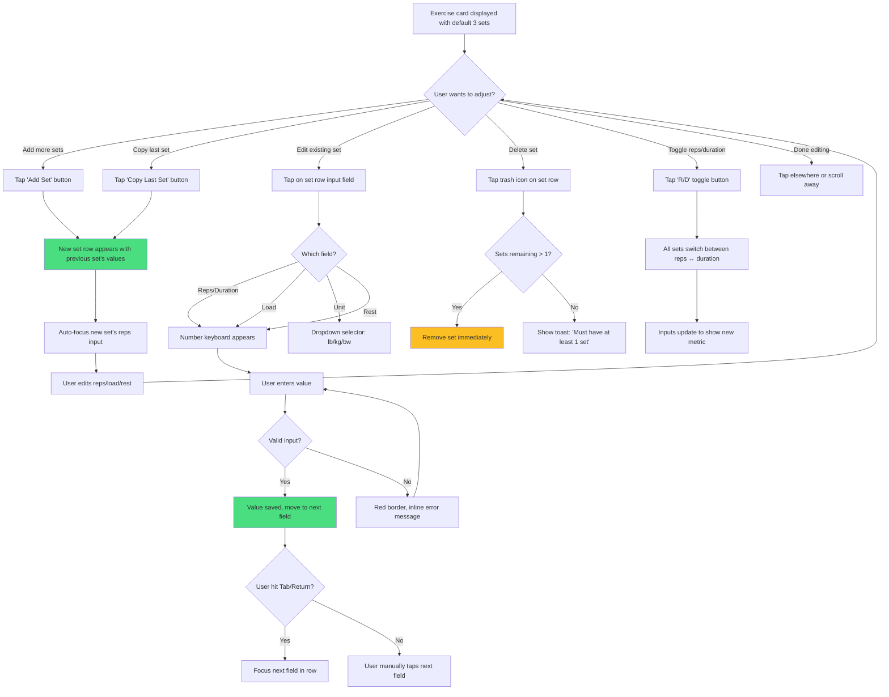
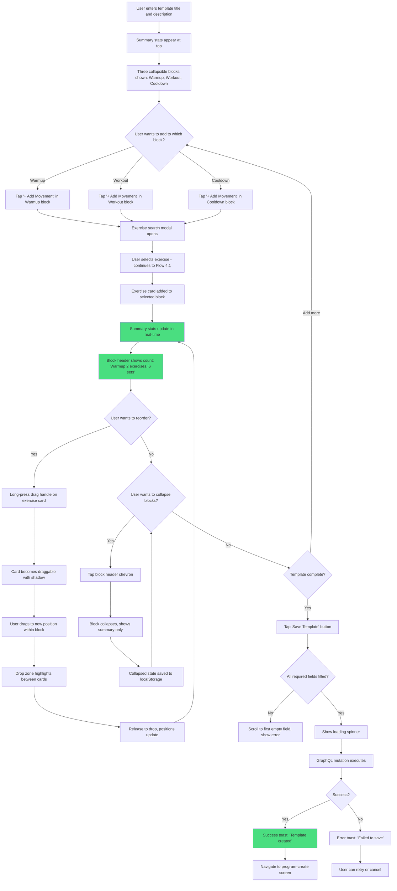
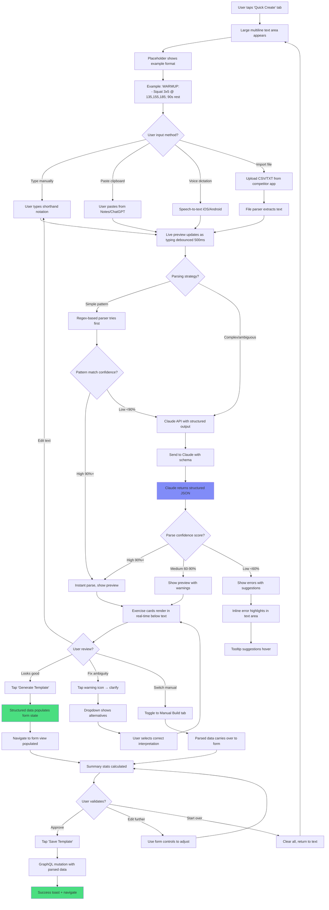
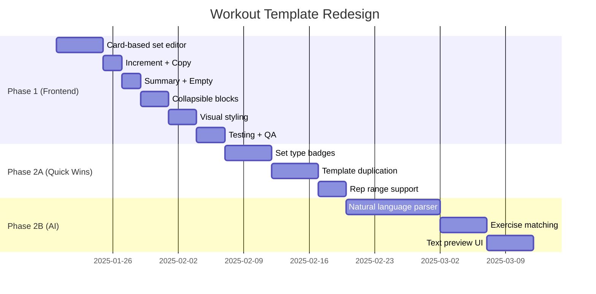

# MindMirror - Workout Template Create Screen UI/UX Specification

**Document Version:** 1.0
**Last Updated:** 2025-01-09
**Author:** UX Expert (Sally) + User
**Status:** Draft - Ready for Implementation

---

## Table of Contents

1. [Introduction](#1-introduction)
2. [UX Goals & Principles](#2-ux-goals--principles)
3. [Information Architecture](#3-information-architecture)
4. [User Flows](#4-user-flows)
5. [Component Library](#5-component-library)
6. [Visual Design & Styling](#6-visual-design--styling)
7. [Phase 1 vs Phase 2 Implementation Split](#7-phase-1-vs-phase-2-implementation-split)
8. [Next Steps](#8-next-steps)

---

## 1. Introduction

### 1.1 Purpose & Scope

This document defines the user experience goals, information architecture, user flows, and visual design specifications for the **Workout Template Create Screen** (`workout-template-create.tsx`) in the MindMirror mobile app. The redesign aims to:

1. **Eliminate usability pain points** - Replace horizontal scrolling tables with touch-friendly card-based inputs
2. **Match industry standards** - Adopt proven patterns from Hevy (our design reference)
3. **Prioritize immediate wins** - Focus on frontend-only improvements that can ship without backend changes

### 1.2 Critical Organization

**Phase 1 (Immediate):** Frontend-only improvements requiring zero backend changes
**Phase 2 (Future Epic):** Features requiring new backend logic, data models, or GraphQL mutations

This specification focuses primarily on **Phase 1** to enable rapid deployment while fully documenting **Phase 2** features for future implementation.

### 1.3 Design Reference

**Primary Reference:** Hevy Workout Tracker
**Reference Materials:** `docs/images/IMG_2935.PNG` through `IMG_2941.PNG`

**Key Patterns Adopted from Hevy:**
- Card-based set editor (vs horizontal tables)
- Set type badges (W for warmup, numbered for working sets)
- Summary statistics header (duration, exercise count, set count)
- Prominent CTA buttons with 44pt minimum touch targets
- Dark theme optimized for gym environments

---

## 2. UX Goals & Principles

### 2.1 Target User Personas

**Primary Persona: Coach/Template Creator**
- Creates reusable workout templates for clients or personal use
- Needs efficiency: build complex templates quickly
- Expects pattern reuse: copy sets, default to last values
- Mobile-first: often building templates between sessions or on-the-go

**Secondary Persona: Athlete/Self-Tracker**
- Uses templates created by coaches or community
- Occasionally creates simple templates for personal workouts
- Needs clarity: understand what's prescribed at a glance
- Prioritizes execution speed over creation complexity

---

### 2.2 Usability Goals

**Phase 1 (Immediate Implementation):**

1. **Efficiency of Input** - Reduce taps/typing needed to add sets
   - Current: 5+ taps per set (focus each input, type, move to next)
   - Target: 2-3 taps per set (copy previous set, quick adjustments)

2. **Touch Target Size** - All interactive elements ≥44pt (iOS HIG)
   - Current: TextInput fields ~32pt in table layout
   - Target: 44pt+ touch areas for all buttons/inputs

3. **Visual Scannability** - Quickly understand template structure
   - Current: Dense table, hard to differentiate exercises
   - Target: Card-based layout with clear visual hierarchy

4. **Error Prevention** - Clear validation, hard to create invalid data
   - Current: No validation until submit
   - Target: Inline validation, disabled states for invalid inputs

**Phase 2 (Backend-Dependent):**

5. **Template Reusability** - Save partial templates, duplicate existing
6. **Smart Defaults** - AI-suggested reps/load based on exercise type
7. **Analytics Integration** - Show estimated duration, volume calculations

---

### 2.3 Design Principles

1. **Mobile-First Touch Targets** - Design for thumbs, not cursors
2. **Progressive Disclosure** - Show complexity only when needed (collapsible sections)
3. **Copy > Create** - Make it easy to duplicate and modify existing content
4. **Immediate Feedback** - Every action has instant visual response
5. **Hevy-Inspired Consistency** - Adopt proven patterns to reduce learning curve

---

### 2.4 Critical UX Flows

#### Flow 1: Add First Exercise to Template (Entry Flow)

**User Goal:** Start building a template from scratch

**Current Pain Points:**
- Empty state just says "No movements yet" with small "Add Movement" button
- Search modal is functional but lacks visual hierarchy
- After adding exercise, set table appears but is cramped

**Phase 1 Improvements:**
```
1. User sees inspiring empty state
   └─ Large icon, "Get started by adding an exercise" text
   └─ Prominent "＋ Add Exercise" button (full width, primary color)

2. Search modal opens
   └─ Search input auto-focused
   └─ Recent exercises shown with thumbnails
   └─ Filter chips: "All Equipment" | "All Muscles"

3. User taps exercise
   └─ Exercise added with smart defaults (3 sets @ 10 reps)
   └─ Card-based layout appears (not table)
   └─ Focus automatically on first set's reps input
```

**Success Criteria:** User completes first exercise addition in <20 seconds

---

#### Flow 2: Configure Sets for an Exercise (Core Creation Flow)

**User Goal:** Define reps, load, rest for multiple sets

**Current Pain Points:**
- Horizontal scrolling table with 5 columns (#, Reps/Dur, Load, Unit, Rest)
- Small input fields, hard to tap accurately
- Each field requires individual focus
- No way to copy previous set

**Phase 1 Improvements:**
```
Set Editor Card Layout:
┌─────────────────────────────────────┐
│ Bulgarian Split Squat           [🗑️]│
│ Barbell                              │
│ Rest Timer: 1min 30s                 │
├─────────────────────────────────────┤
│ SET    LOAD         REPS/DUR    REST│
│  W    135 lb    [±]  10  [±]    90s │ ← Warmup badge, increment buttons
│  1    135 lb    [±]  10  [±]    90s │
│  2    135 lb    [±]  10  [±]    90s │
│                                      │
│ [Copy Last Set]  [Add Set]          │
└─────────────────────────────────────┘

Key Changes:
- 3-column layout (no horizontal scroll)
- ±Increment buttons for quick adjustments
- "Copy Last Set" button (duplicates row)
- Set type badge (W = warmup, 1/2/3 = working sets)
- Larger touch targets (44pt minimum)
```

**Success Criteria:** User adds 5 sets in <30 seconds

---

#### Flow 3: Build Multi-Exercise Template (Complex Creation Flow)

**User Goal:** Create 3-block template (Warmup → Workout → Cooldown)

**Current Pain Points:**
- Blocks shown sequentially but feel cluttered
- Hard to see template overview
- No summary stats (total duration, exercise count)

**Phase 1 Improvements:**
```
Template Header (NEW):
┌─────────────────────────────────────┐
│ 📊 Push Day                          │
│ ⏱️ Est 45min  |  💪 5 exercises  |  📈 16 sets │
└─────────────────────────────────────┘

Collapsible Blocks:
┌─────────────────────────────────────┐
│ ▾ Warmup (2 exercises, 4 sets)      │
│   [Exercise cards here...]          │
│   [＋ Add Movement]                  │
└─────────────────────────────────────┘

┌─────────────────────────────────────┐
│ ▾ Workout (3 exercises, 12 sets)    │
│   [Exercise cards here...]          │
│   [＋ Add Movement]                  │
└─────────────────────────────────────┘

┌─────────────────────────────────────┐
│ ▸ Cooldown (0 exercises)            │ ← Collapsed when empty
│   [＋ Add Movement]                  │
└─────────────────────────────────────┘
```

**Success Criteria:** User creates 5-exercise template in <3 minutes

---

## 3. Information Architecture

### 3.1 Screen Inventory & Structure

The workout template create screen follows a **single-page, vertically scrolling** layout with collapsible sections:

```
Workout Template Create Screen
├── App Bar (Header)
│   ├── Back Button
│   └── Title: "Create Workout Template"
│
├── Template Details Section
│   ├── Title Input
│   ├── Description Input (optional, markdown preview)
│   └── Summary Stats Header (NEW - Phase 1)
│       ├── Est Duration (calculated)
│       ├── Exercise Count
│       └── Total Sets
│
├── Blocks Section
│   ├── Warmup Block (Collapsible)
│   │   ├── Block Header (shows exercise/set count)
│   │   ├── Exercise Cards (0-n)
│   │   │   ├── Exercise Header (name, drag handle, delete)
│   │   │   ├── Equipment Label
│   │   │   ├── Rest Timer
│   │   │   ├── Set Editor (Card-based, NEW)
│   │   │   └── Add Set Button
│   │   └── Add Movement Button
│   │
│   ├── Workout Block (Collapsible)
│   │   └── [Same structure as Warmup]
│   │
│   └── Cooldown Block (Collapsible)
│       └── [Same structure as Warmup]
│
└── Save Template Button (Sticky Footer)
```

---

### 3.2 Navigation Structure

**Entry Points:**
- From `/workout.tsx` → FAB → "Create Template"
- From workout instance → "Save as Template" (future)

**Exit Points:**
- **Cancel** → Confirmation dialog if unsaved changes → Back to `/workout.tsx`
- **Save** → Success toast → Navigate to `/program-create?addTemplateId={id}` (existing behavior)

**No Secondary Navigation** - Single-purpose screen, linear flow

---

### 3.3 Component Hierarchy



---

### 3.4 Data Flow (State Management)

**Current State Structure** (preserve in Phase 1):
```typescript
type SetDraft = {
  position: number
  reps?: number
  duration?: number
  loadValue?: number
  loadUnit?: string
  restDuration?: number
}

type MovementDraft = {
  name: string
  position: number
  metricUnit: 'iterative' | 'temporal' | 'breath' | 'other'
  sets: SetDraft[]
}

type PrescriptionDraft = {
  name: string
  position: number
  block: 'warmup' | 'workout' | 'cooldown' | 'other'
  prescribedRounds: number
  movements: MovementDraft[]
}
```

**New Derived State** (Phase 1 calculations):
```typescript
// Calculate in component, no new state needed
const totalExercises = prescriptions.flatMap(p => p.movements).length
const totalSets = prescriptions.flatMap(p => p.movements.flatMap(m => m.sets)).length

// Simple duration estimate: sum of all rest periods + 20s per set for work
const estimatedDuration = prescriptions
  .flatMap(p => p.movements)
  .flatMap(m => m.sets)
  .reduce((total, set) => total + (set.restDuration || 60) + 20, 0) / 60 // minutes
```

**No Backend Changes Required** ✅

---

## 4. User Flows

### 4.1 Flow: Add First Exercise to Template

**User Goal:** Start building a template from scratch

**Entry Points:**
- New template screen (empty state)
- "Create Template" from workout hub

**Success Criteria:**
- Exercise added with default sets in <20 seconds
- User understands next steps (add more exercises or configure sets)

#### Flow Diagram



#### Edge Cases & Error Handling

- **No search results found:**
  - Show "No matches" message
  - Offer "＋ Create Exercise" button → Custom exercise modal

- **API timeout (ExerciseDB):**
  - Show loading spinner for 3s max
  - Fallback: "Unable to load external exercise, try again?"
  - Alternative: "Create custom exercise instead"

- **User taps Cancel with unsaved exercise:**
  - No confirmation needed (exercise not yet added to state)

- **User adds duplicate exercise:**
  - Allow it (coaches often program same exercise twice)
  - Visual indicator: "(2nd occurrence)" in card header

---

### 4.2 Flow: Configure Sets for an Exercise

**User Goal:** Define reps, load, rest for multiple sets

**Entry Points:**
- After adding new exercise (auto-focus)
- Tapping existing exercise card
- Editing from template review

**Success Criteria:**
- User adds 5 sets in <30 seconds
- No accidental deletions or invalid inputs

#### Flow Diagram



#### Edge Cases & Error Handling

- **User enters non-numeric value:**
  - Reject input, show red border
  - Toast: "Please enter a number"

- **User tries to delete only set:**
  - Prevent deletion
  - Toast: "Exercise must have at least 1 set"

- **User toggles reps → duration with existing rep values:**
  - Convert reps to seconds (e.g., 10 reps → 30s default)
  - Show confirmation: "Converted to time-based sets"

- **User selects 'bodyweight' unit but enters load value:**
  - Clear load value automatically
  - Grey out load input field

- **Keyboard covers input field (iOS):**
  - Use `KeyboardAvoidingView` (already implemented)
  - Scroll focused input above keyboard

---

### 4.3 Flow: Build Multi-Exercise Template

**User Goal:** Create 3-block template (Warmup → Workout → Cooldown)

**Entry Points:**
- New template creation
- Editing existing template

**Success Criteria:**
- User creates 5-exercise template in <3 minutes
- Template structure is clear and scannable

#### Flow Diagram



#### Edge Cases & Error Handling

- **User creates template with 0 exercises:**
  - Disable "Save" button
  - Show tooltip: "Add at least 1 exercise to save"

- **User creates template with title but no description:**
  - Allow (description is optional)

- **User drags exercise between blocks (Warmup → Workout):**
  - **Phase 1**: Not supported, drop zones only within same block
  - **Phase 2**: Enable cross-block dragging

- **User collapses block then adds exercise:**
  - Block auto-expands to show new exercise
  - Smooth animation

- **Network error during save:**
  - Show retry button
  - Don't navigate away
  - Preserve all entered data in state

- **User hits back button with unsaved changes:**
  - Show confirmation: "You have unsaved changes. Discard?"
  - Options: "Keep Editing" | "Discard"

---

### 4.4 Flow: Edit Existing Template (Future Enhancement)

**User Goal:** Modify a previously saved template

**Entry Points:**
- Template library → Tap template → "Edit" button
- Duplicate template → Edit copy

**Success Criteria:**
- Changes saved without losing original
- Clear indication of "editing mode"

> **Note:** This flow requires Phase 2 backend support for template versioning/history. Documented here for completeness but not implemented in Phase 1.

---

### 4.5 Flow: Natural Language Template Creation (Phase 2 - AI-Powered)

> **Priority:** First agent integration after Phase 1 ships
> **User Feedback Required:** Deploy Phase 1 first, gather real usage patterns, then implement this based on actual user needs

**User Goal:** Create workout templates by typing/pasting natural language instead of form-based input

**Target Persona:** Power users (coaches, experienced athletes) who think in shorthand notation

**Success Criteria:**
- Parse accuracy >90% for common formats
- Template creation time reduced from 3-5 min → <30 seconds
- Supports copy/paste from external sources (Notes, ChatGPT, competitor apps)

#### Entry Points

- Create Template screen → **[📝 Quick Create]** tab toggle
- Clipboard detection: "Detected workout text, quick create?"
- Voice command: "Create template from dictation"

#### Flow Diagram



#### Dual-Pane UI Layout (Mobile)

```
┌─────────────────────────────────────────┐
│ Create Workout Template                 │
├─────────────────────────────────────────┤
│ [📝 Quick Create] | [🔧 Manual Build]   │ ← Tabs
├─────────────────────────────────────────┤
│                                          │
│ ┌──────────────────────────────────────┐│
│ │ Type or paste workout...             ││
│ │                                      ││
│ │ WARMUP:                              ││
│ │ - Squat 3x5 @ 135,155,185; 90s rest ││ ← Text input
│ │ - Leg curl 2x12 @ 40lb               ││
│ │                                      ││
│ │ WORKOUT:                             ││
│ │ - Bench 5x5 @ 185; 3 min rest       ││
│ └──────────────────────────────────────┘│
│                                          │
│ ─────── Live Preview ───────            │
│                                          │
│ ✅ Warmup (2 exercises, 5 sets)         │
│ ┌──────────────────────────────────────┐│
│ │ Squat - Barbell              [Edit] ││
│ │ SET  LOAD    REPS   REST            ││
│ │ 1    135 lb  5      90s      ✅     ││
│ │ 2    155 lb  5      90s      ✅     ││
│ │ 3    185 lb  5      90s      ✅     ││
│ └──────────────────────────────────────┘│
│                                          │
│ ⚠️  Ambiguities detected:                │
│ - "Squat" matched "Back Squat" - OK?    │
│                                          │
│ [Generate Template] ───────────────────→ │
└─────────────────────────────────────────┘
```

#### Supported Notation Formats

**Set Notation:**

| Input | Parsed As |
|-------|-----------|
| `3x5` | 3 sets of 5 reps |
| `3 x 5` | 3 sets of 5 reps |
| `5 reps x 3 sets` | 3 sets of 5 reps |
| `5x3` | 5 sets of 3 reps |
| `3 sets @ 10 reps` | 3 sets of 10 reps |
| `3x8-12` | 3 sets of 8-12 rep range (Phase 2 feature) |

**Load Notation:**

| Input | Parsed As |
|-------|-----------|
| `@ 135` | 135 lb (all sets same load) |
| `@ 135, 155, 185` | Progressive loads across sets |
| `@ 135lb` or `@ 135 lb` | 135 pounds |
| `@ 60kg` | 60 kilograms |
| `@ bw` or `@ bodyweight` | Bodyweight |
| `@ 45+25` | 70 lb (plate math) |

**Rest Notation:**

| Input | Parsed As |
|-------|-----------|
| `90s rest` | 90 seconds |
| `90 sec` | 90 seconds |
| `1.5 min` or `1:30` | 90 seconds |
| `3 minutes` | 180 seconds |
| No rest specified | 60s default |

**Block Headers:**

| Input | Recognized As |
|-------|---------------|
| `WARMUP:` or `Warmup` or `warm-up` | Warmup block |
| `WORKOUT:` or `Main` or `Working Sets` | Workout block |
| `COOLDOWN:` or `Cool down` or `Finisher` | Cooldown block |

#### Backend Requirements (Phase 2)

**New GraphQL Mutations:**
```graphql
mutation ParseWorkoutText($input: ParseWorkoutTextInput!) {
  parseWorkoutText(input: $input) {
    success: Boolean!
    confidence: Float!
    parsed: PracticeTemplateInput
    ambiguities: [Ambiguity!]
    errors: [ParseError!]
  }
}

input ParseWorkoutTextInput {
  text: String!
  userPreferences: UserParsePreferences
}

type Ambiguity {
  location: String!
  issue: String!
  suggestions: [String!]!
}
```

**New Services:**
- `WorkoutTextParser` - Regex + LLM hybrid parsing
- `ExerciseNameMatcher` - Fuzzy matching against exercise DB
- `NotationNormalizer` - Handle regional variations

**Success Metrics:**

- **Phase 2A (Beta) Goals:**
  - 50% of beta users try Quick Create
  - 80% parse accuracy (regex-based)
  - <5s average parse time

- **Phase 2B (LLM) Goals:**
  - 95% parse accuracy (hybrid approach)
  - <2s average parse time (with caching)
  - 30% reduction in template creation time

- **Phase 2C (GA) Goals:**
  - 40% of all templates created via Quick Create
  - >90% user satisfaction (post-create survey)
  - 50% time savings vs manual form

---

## 5. Component Library

### 5.1 Design System Approach

**Framework:** React Native with NativeWind (Tailwind CSS)

**Existing Components (Reuse):**
- ✅ `@/components/ui/box` - Container with spacing/padding
- ✅ `@/components/ui/vstack` - Vertical stack layout
- ✅ `@/components/ui/hstack` - Horizontal stack layout
- ✅ `@/components/ui/text` - Styled text component
- ✅ `@/components/ui/button` - Primary/secondary buttons
- ✅ `@/components/common/AppBar` - Top navigation bar

**New Components (Phase 1):**
- 🆕 `ExerciseCard` - Collapsible exercise container with set editor
- 🆕 `SetEditorCard` - Card-based set input (replaces table)
- 🆕 `SetRow` - Individual set input row with increment buttons
- 🆕 `CollapsibleBlockSection` - Warmup/Workout/Cooldown sections
- 🆕 `SummaryStatsHeader` - Template stats display
- 🆕 `EmptyStateCard` - Inspiring empty state with CTA
- 🆕 `IncrementButton` - ±1 quick adjustment buttons

---

### 5.2 Core Components (Phase 1)

#### Component: EmptyStateCard

**Purpose:** Show when template has no exercises, guide user to add first exercise

**Variants:**
- Default (no exercises in template)
- Block-level (specific block is empty)

**States:**
- Default
- Hover/Press (on button)

**Props:**
```typescript
interface EmptyStateCardProps {
  title?: string
  subtitle?: string
  icon?: React.ReactNode
  ctaLabel?: string
  onCTAPress: () => void
  variant?: 'template' | 'block'
}
```

**Visual Spec:**
```tsx
<EmptyStateCard
  icon={<DumbbellIcon size={60} color="#9ca3af" />}
  title="No exercises yet"
  subtitle="Get started by adding an exercise to your template."
  ctaLabel="+ Add Exercise"
  onCTAPress={handleAddExercise}
/>
```

**Layout:**
```
┌─────────────────────────────────────┐
│                                      │
│             🏋️ (60pt icon)            │
│                                      │
│        No exercises yet              │ ← 18pt semibold
│                                      │
│  Get started by adding an exercise  │ ← 14pt regular
│      to your template.               │
│                                      │
│  ┌────────────────────────────────┐ │
│  │       + Add Exercise           │ │ ← 44pt min height
│  └────────────────────────────────┘ │
│                                      │
└─────────────────────────────────────┘
```

---

#### Component: SummaryStatsHeader

**Purpose:** Display real-time calculated template statistics

**Props:**
```typescript
interface SummaryStatsHeaderProps {
  exerciseCount: number
  totalSets: number
  estimatedDuration: number  // minutes
  loading?: boolean
}
```

**Calculation Logic:**
```typescript
// Simple duration estimate (Phase 1)
const estimatedDuration = useMemo(() => {
  const totalSets = prescriptions
    .flatMap(p => p.movements)
    .flatMap(m => m.sets).length

  const totalRestTime = prescriptions
    .flatMap(p => p.movements)
    .flatMap(m => m.sets)
    .reduce((sum, set) => sum + (set.restDuration || 60), 0)

  const workTime = totalSets * 20  // 20s average per set

  return Math.ceil((totalRestTime + workTime) / 60)  // minutes
}, [prescriptions])
```

---

#### Component: CollapsibleBlockSection

**Purpose:** Group exercises by workout phase (Warmup/Workout/Cooldown)

**Variants:**
- Warmup (yellow accent)
- Workout (blue accent)
- Cooldown (green accent)

**States:**
- Expanded (default)
- Collapsed
- Empty

**Props:**
```typescript
interface CollapsibleBlockSectionProps {
  blockType: 'warmup' | 'workout' | 'cooldown'
  title: string
  exerciseCount: number
  totalSets: number
  isCollapsed?: boolean
  onToggleCollapse: () => void
  onAddExercise: () => void
  children: React.ReactNode
}
```

**Collapse State Persistence:**
```typescript
// Save to AsyncStorage (RN localStorage)
const [collapseState, setCollapseState] = useState<Record<string, boolean>>(() => {
  const saved = AsyncStorage.getItem('blockCollapseState')
  return saved ? JSON.parse(saved) : {}
})

const handleToggle = (blockType: string) => {
  const newState = { ...collapseState, [blockType]: !collapseState[blockType] }
  setCollapseState(newState)
  AsyncStorage.setItem('blockCollapseState', JSON.stringify(newState))
}
```

---

#### Component: ExerciseCard

**Purpose:** Display single exercise with all sets, collapsible details

**Props:**
```typescript
interface ExerciseCardProps {
  movement: MovementDraft
  onUpdate: (updates: Partial<MovementDraft>) => void
  onDelete: () => void
  onReorder: (direction: 'up' | 'down') => void
  isDraggable?: boolean
}
```

**Layout:**
```
┌─────────────────────────────────────┐
│ [≡] Bulgarian Split Squat       [🗑️] │ ← Header (drag handle + delete)
│ Barbell                              │ ← Equipment label
│ Rest Timer: 1min 30s                 │ ← Default rest time
├─────────────────────────────────────┤
│ SET    LOAD         REPS        REST│ ← Column headers
│  W    135 lb  [±]  10  [±]      90s │ ← Warmup set
│  1    135 lb  [±]  10  [±]      90s │ ← Working sets
│  2    135 lb  [±]  10  [±]      90s │
│                                      │
│ [Copy Last Set]         [Add Set]   │ ← Action buttons
└─────────────────────────────────────┘
```

---

#### Component: SetEditorCard

**Purpose:** Card-based set input replacing horizontal table

**Props:**
```typescript
interface SetEditorCardProps {
  sets: SetDraft[]
  metricUnit: 'iterative' | 'temporal' | 'breath' | 'other'
  onUpdateSet: (index: number, updates: Partial<SetDraft>) => void
  onAddSet: () => void
  onDeleteSet: (index: number) => void
  onCopyLastSet: () => void
}
```

**Column Widths (Responsive):**
```typescript
const columnWidths = {
  set: '15%',      // "W", "1", "2"
  load: '35%',     // "135 lb [±]"
  reps: '30%',     // "10 [±]"
  rest: '20%'      // "90s"
}
```

---

#### Component: SetRow

**Purpose:** Single set input row with increment buttons

**Variants:**
- Warmup (yellow badge)
- Working (numbered badge)

**Props:**
```typescript
interface SetRowProps {
  set: SetDraft
  setNumber: number
  isWarmup?: boolean
  metricUnit: 'iterative' | 'temporal'
  onUpdate: (updates: Partial<SetDraft>) => void
  onDelete: () => void
  canDelete: boolean
}
```

**Layout:**
```
┌─────┬────────────┬────────────┬─────────┐
│  1  │ 135 lb [±] │  10  [±]   │  90s    │
└─────┴────────────┴────────────┴─────────┘
  15%      35%          30%         20%
```

---

#### Component: IncrementButton

**Purpose:** Quick ±1 adjustment for numeric inputs

**Props:**
```typescript
interface IncrementButtonProps {
  direction: 'up' | 'down'
  onPress: () => void
  disabled?: boolean
  size?: 'sm' | 'md'
}
```

**Touch Target:**
```typescript
// Minimum 44pt touch target (iOS HIG)
const styles = {
  container: "p-2 bg-background-100 dark:bg-background-800 rounded min-w-[44px] min-h-[44px] items-center justify-center",
  icon: "text-base font-bold text-typography-700 dark:text-gray-300"
}
```

---

### 5.3 Usage Guidelines

**EmptyStateCard:**
- Use at template level when no exercises added
- Use at block level when specific block is empty
- Always provide clear CTA button

**SummaryStatsHeader:**
- Always show above block sections
- Update in real-time as sets/exercises change

**CollapsibleBlockSection:**
- Default to expanded state
- Persist collapse preference to AsyncStorage
- Show summary counts when collapsed

**ExerciseCard:**
- Drag handle visible only when 2+ exercises
- Delete requires confirmation

**SetEditorCard:**
- Column headers always visible
- Minimum 1 set required
- "Add Set" defaults to previous set's values

**SetRow:**
- Auto-focus on newly added row
- Invalid input shows red border

---

## 6. Visual Design & Styling

### 6.1 Color Palette

#### Brand Colors (Existing MindMirror Palette)

| Color Type | Light Mode | Dark Mode | Usage |
|------------|------------|-----------|-------|
| **Primary** | `#1d4ed8` (blue-700) | `#60a5fa` (blue-400) | CTAs, active states |
| **Secondary** | `#7c3aed` (violet-600) | `#a78bfa` (violet-400) | Accents, highlights |
| **Success** | `#16a34a` (green-600) | `#4ade80` (green-400) | Completed workouts |
| **Warning** | `#f59e0b` (amber-500) | `#fbbf24` (amber-400) | Warmup sets |
| **Error** | `#dc2626` (red-600) | `#f87171` (red-400) | Errors, destructive actions |
| **Neutral** | `#6b7280` (gray-500) | `#9ca3af` (gray-400) | Borders, secondary text |

#### Workout-Specific Colors (New)

| Element | Light Mode | Dark Mode | Purpose |
|---------|------------|-----------|---------|
| **Warmup Accent** | `#fef3c7` (yellow-100) | `#78350f` (yellow-900/20) | Warmup block background |
| **Warmup Badge** | `#f59e0b` (amber-500) | `#fbbf24` (amber-400) | "W" badge |
| **Workout Accent** | `#dbeafe` (blue-100) | `#1e3a8a` (blue-900/20) | Workout block background |
| **Cooldown Accent** | `#d1fae5` (green-100) | `#14532d` (green-900/20) | Cooldown block background |

---

### 6.2 Typography

#### Font Families

- **Primary:** System default (`-apple-system, BlinkMacSystemFont, "Segoe UI", Roboto`)
- **Monospace:** `SF Mono, Consolas, Monaco` (for text input - Phase 2)

#### Type Scale

| Element | Size | Weight | Line Height | Usage |
|---------|------|--------|-------------|-------|
| **H1** | 24pt | 700 (Bold) | 32pt | Screen titles |
| **H2** | 20pt | 600 (Semibold) | 28pt | Section headers |
| **H3** | 18pt | 600 (Semibold) | 24pt | Exercise names |
| **Body** | 16pt | 400 (Regular) | 24pt | Default text |
| **Body Small** | 14pt | 400 (Regular) | 20pt | Descriptions, labels |
| **Caption** | 12pt | 500 (Medium) | 16pt | Metadata |
| **Overline** | 11pt | 700 (Bold) | 16pt | Column headers |

---

### 6.3 Spacing & Layout

#### Spacing Scale (Tailwind)

| Token | Value | Usage |
|-------|-------|-------|
| `gap-1` | 4pt | Tight spacing (icon + text) |
| `gap-2` | 8pt | Set rows, inline elements |
| `gap-3` | 12pt | Exercise cards within block |
| `gap-4` | 16pt | Block sections |
| `gap-6` | 24pt | Major screen sections |

#### Padding Standards

| Element | Padding | Rationale |
|---------|---------|-----------|
| **Screen Container** | `px-4 py-3` | 16pt horizontal, 12pt vertical |
| **Card Padding** | `p-4` | 16pt all sides |
| **Button Padding** | `py-3 px-4` | 12pt vertical, 16pt horizontal |
| **Touch Targets** | `min-h-[44px] min-w-[44px]` | iOS HIG compliance |

#### Border Radius

| Element | Radius | Tailwind Class |
|---------|--------|----------------|
| **Cards** | 12pt | `rounded-xl` |
| **Buttons** | 8pt | `rounded-lg` |
| **Inputs** | 6pt | `rounded-md` |

---

### 6.4 Iconography

**Icon Library:** `react-native-vector-icons` (Material Icons or Ionicons)

**Icon Usage Map:**

| Icon | Name | Size | Usage |
|------|------|------|-------|
| ≡ | `drag-handle` | 24pt | Reorder handle |
| 🗑️ | `trash` | 20pt | Delete button |
| ＋ | `add` | 20pt | Add exercise/set |
| ▾ | `chevron-down` | 16pt | Expanded block |
| ▸ | `chevron-right` | 16pt | Collapsed block |
| 🏋️ | `dumbbell` | 60pt | Empty state |
| ⏱️ | `timer` | 16pt | Duration stat |
| 💪 | `fitness` | 16pt | Exercise count |
| 📈 | `trending-up` | 16pt | Set count |

---

### 6.5 Dark Mode

**Color Adjustments:**
- Increase contrast ratios (WCAG AAA)
- Use softer accent colors (blue-400 vs blue-700)
- Elevated surfaces with subtle shadows

---

### 6.6 Animation & Micro-interactions

#### Transitions

| Element | Duration | Easing | Trigger |
|---------|----------|--------|---------|
| **Block Collapse** | 200ms | `ease-in-out` | Toggle chevron |
| **Card Delete** | 150ms | `ease-out` | Delete confirm |
| **Input Focus** | 100ms | `ease-in-out` | Field tap |
| **Button Press** | 80ms | `ease-out` | Touch down/up |

#### Haptic Feedback

```typescript
import { Haptics } from 'expo-haptics'

const handleDelete = () => {
  Haptics.impactAsync(Haptics.ImpactFeedbackStyle.Medium)
  // ... delete logic
}
```

---

### 6.7 Accessibility

**Touch Targets:**
- ✅ **Minimum 44pt** for all interactive elements

**Color Contrast:**
- ✅ **4.5:1 minimum** for body text (WCAG AA)
- ✅ **3:1 minimum** for UI components

**Screen Reader Support:**
```typescript
<TouchableOpacity
  accessible={true}
  accessibilityLabel="Add exercise to warmup block"
  accessibilityHint="Opens exercise search modal"
  accessibilityRole="button"
>
  <Text>+ Add Movement</Text>
</TouchableOpacity>
```

---

## 7. Phase 1 vs Phase 2 Implementation Split

> **Critical Context:** This section explicitly defines the boundary between frontend-only improvements (Phase 1) and backend-dependent features (Phase 2).

---

### 7.1 Phase 1: Immediate Frontend Implementation

**Scope:** UI/UX improvements using **existing GraphQL schema** without modifications

**Timeline:** 2-3 weeks of frontend development

**Deployment:** Can ship immediately after implementation

---

#### ✅ Phase 1 Features (Ship Now)

##### 1. Replace Table Layout with Card-Based Set Editor

**Current:**
```tsx
// Horizontal scrolling table (workout-template-create.tsx:285-312)
<ScrollView horizontal>
  <Table>
    <Row>#, Reps/Dur, Load, Unit, Rest</Row>
  </Table>
</ScrollView>
```

**Phase 1:**
```tsx
<SetEditorCard>
  <ColumnHeaders>SET | LOAD | REPS | REST</ColumnHeaders>
  <SetRow setNumber={1} {...props} />
  <SetRow setNumber={2} {...props} />
</SetEditorCard>
```

**Why No Backend Change:**
- Uses existing `SetDraft` type structure
- Same data fields
- Pure UI refactor

**Files:**
- `components/workout/SetEditorCard.tsx` (new)
- `components/workout/SetRow.tsx` (new)
- `app/(app)/workout-template-create.tsx` (update)

---

##### 2. Add Increment/Decrement Buttons

**Feature:** ± buttons for quick adjustments

**Why No Backend Change:**
- Frontend state update only
- No API changes

**Files:**
- `components/ui/IncrementButton.tsx` (new)

---

##### 3. "Copy Last Set" Button

**Feature:** Duplicate previous set values

**Why No Backend Change:**
- Client-side array manipulation
- Updates local state

**Implementation:**
```typescript
const handleCopyLastSet = () => {
  const lastSet = movement.sets[movement.sets.length - 1]
  const newSet = { ...lastSet, position: movement.sets.length + 1 }
  onUpdate({ sets: [...movement.sets, newSet] })
}
```

---

##### 4. Auto-Default New Sets

**Feature:** Pre-populate new sets with last set's values

**Why No Backend Change:**
- Frontend default logic
- No schema changes

---

##### 5. Summary Stats Header

**Feature:** Exercise count, total sets, estimated duration

**Why No Backend Change:**
- Pure derived state
- Calculated client-side

**Calculation:**
```typescript
const estimatedDuration = useMemo(() => {
  const sets = prescriptions.flatMap(p => p.movements.flatMap(m => m.sets))
  const totalRest = sets.reduce((sum, s) => sum + (s.restDuration || 60), 0)
  const workTime = sets.length * 20
  return Math.ceil((totalRest + workTime) / 60)
}, [prescriptions])
```

---

##### 6. Improved Empty State

**Feature:** Large icon, clear CTA

**Why No Backend Change:**
- Pure UI component
- Conditional rendering

---

##### 7. Collapsible Block Sections

**Feature:** Collapse/expand blocks

**Why No Backend Change:**
- Client-side UI state
- AsyncStorage persistence (local)

---

##### 8. Larger Touch Targets (44pt)

**Feature:** iOS HIG compliance

**Why No Backend Change:**
- CSS styling only

---

##### 9. Visual Styling Updates

**Feature:** Hevy-inspired styling

**Why No Backend Change:**
- Pure CSS/Tailwind

---

##### 10. Improved Exercise Card Layout

**Feature:** Better organization

**Why No Backend Change:**
- Uses existing fields
- UI rearrangement

---

#### 📊 Phase 1 Summary

| Feature | Files | Effort |
|---------|-------|--------|
| Card set editor | 3 new | High |
| Increment buttons | 2 new | Low |
| Copy last set | 1 update | Low |
| Auto-default | 1 update | Low |
| Summary stats | 1 new | Medium |
| Empty state | 1 new | Low |
| Collapsible blocks | 1 new | Medium |
| Touch targets | All | Low |
| Styling | All | Medium |
| Exercise card | 1 refactor | Medium |

**Total Effort:** 2-3 weeks (frontend only)
**Risk:** Low (no backend dependencies)

---

### 7.2 Phase 2: Backend-Dependent Features

**Scope:** Features requiring GraphQL mutations, schema changes, or new services

**Timeline:** 4-6 weeks (backend + frontend)

---

#### ❌ Phase 2 Features (Requires Backend)

##### 1. Set Type Badges (W, F, D)

**Backend Dependency:**
- New field: `SetDraft.setType?: 'warmup' | 'working' | 'failure' | 'drop'`
- GraphQL schema update
- Database migration

**Schema:**
```graphql
enum SetType {
  WARMUP
  WORKING
  FAILURE
  DROP
}
```

---

##### 2. Rep Range Support (8-12)

**Backend Dependency:**
- Change `Set.reps` from `Int` to `String`
- Or add `repsMin`/`repsMax` fields
- Database migration

---

##### 3. Template Duplication

**Backend Dependency:**
- New mutation: `duplicatePracticeTemplate(id: ID!)`
- Server-side deep copy logic

---

##### 4. Template Versioning

**Backend Dependency:**
- New table: `template_versions`
- Version control logic

---

##### 5. Natural Language Parsing (AI) 🔥

**Backend Dependency:**
- Claude API integration
- New service: `WorkoutTextParser`
- Exercise name fuzzy matching
- GraphQL mutation: `parseWorkoutText`

**Priority:** **First agent integration after Phase 1**

**Services:**
```python
class WorkoutTextParser:
    async def parse(self, text: str) -> ParsedTemplate:
        result = await self.claude.parse_workout(text)
        for exercise in result.exercises:
            exercise.matched_id = await self.match_exercise(exercise.name)
        return result
```

---

##### 6. Volume/Tonnage Calculations

**Backend Dependency:**
- Calculation service
- Caching for performance

---

##### 7. Muscle Group Visualization

**Backend Dependency:**
- Exercise → muscle group mapping
- ExerciseDB API caching

---

##### 8. Smart Defaults

**Backend Dependency:**
- ML model or rule-based suggestions
- User history analysis

---

##### 9. Template Sharing

**Backend Dependency:**
- Sharing permissions
- Public template discovery
- Social features

---

##### 10. Supersets/Giant Sets

**Backend Dependency:**
- New field: `Movement.supersetGroup`
- Execution logic

---

#### 📊 Phase 2 Summary

| Feature | Backend Work | Effort | Priority |
|---------|--------------|--------|----------|
| Set badges | Schema + migration | Low | High |
| Rep ranges | Schema + migration | Low | Medium |
| Duplication | New mutation | Medium | High |
| Versioning | New tables | High | Low |
| **NL Parsing** | **Claude API** | **High** | **CRITICAL** |
| Volume calc | Service | Medium | Medium |
| Muscle viz | ExerciseDB | High | Low |
| Smart defaults | ML service | High | Low |
| Sharing | Social features | High | Medium |
| Supersets | Schema + logic | Medium | Medium |

---

### 7.3 Implementation Roadmap



**Deployment Strategy:**

1. **Week 1-3:** Phase 1 development
2. **Week 3:** Internal testing + feedback
3. **Week 4:** Phase 1 ships to production
4. **Week 5-6:** Monitor usage, gather analytics
5. **Week 7+:** Phase 2A quick wins
6. **Week 10+:** Phase 2B AI integration

---

### 7.4 Decision Criteria

**A feature is Phase 1 if ALL are true:**

1. ✅ Uses existing GraphQL schema
2. ✅ No database migrations
3. ✅ No new backend services
4. ✅ Pure client-side state
5. ✅ No external API calls

**Otherwise, it's Phase 2.**

---

### 7.5 Testing Strategy

**Phase 1 (Frontend):**
```typescript
describe('SetEditorCard', () => {
  it('should add new set with previous values', () => {
    const { getByText } = render(<SetEditorCard sets={mockSets} />)
    fireEvent.press(getByText('Add Set'))
    expect(mockOnUpdate).toHaveBeenCalledWith({
      sets: expect.arrayContaining([
        expect.objectContaining({
          loadValue: mockSets[mockSets.length - 1].loadValue
        })
      ])
    })
  })
})
```

**Phase 2 (Backend + Frontend):**
```python
async def test_parse_workout_text():
    input_text = "Squat 3x5 @ 135,155,185; 90s rest"
    result = await parse_workout_text(input_text)

    assert result.success == True
    assert result.confidence > 0.9
    assert len(result.parsed.movements) == 1
    assert result.parsed.movements[0].sets[0].load_value == 135
```

---

## 8. Next Steps

### 8.1 Immediate Actions (Phase 1)

1. **Create Component Files**
   - `components/workout/EmptyStateCard.tsx`
   - `components/workout/SummaryStatsHeader.tsx`
   - `components/workout/CollapsibleBlockSection.tsx`
   - `components/workout/ExerciseCard.tsx` (refactor)
   - `components/workout/SetEditorCard.tsx`
   - `components/workout/SetRow.tsx`
   - `components/ui/IncrementButton.tsx`

2. **Update Existing Screen**
   - `app/(app)/workout-template-create.tsx`

3. **Implementation Order**
   - Start with `EmptyStateCard` (simplest)
   - Build `SetRow` and `IncrementButton`
   - Combine into `SetEditorCard`
   - Create `ExerciseCard` wrapper
   - Add `CollapsibleBlockSection`
   - Integrate `SummaryStatsHeader`
   - Final styling polish

4. **Testing**
   - Unit tests for each component
   - Integration test for full template creation flow
   - Accessibility testing (VoiceOver, TalkBack)
   - Dark mode testing

5. **QA Checklist**
   - ✅ All touch targets ≥44pt
   - ✅ Collapsible state persists across app restarts
   - ✅ Summary stats update in real-time
   - ✅ Copy last set duplicates all values
   - ✅ Cannot delete only set in exercise
   - ✅ Drag-to-reorder works smoothly
   - ✅ Dark mode colors have sufficient contrast
   - ✅ Keyboard doesn't cover inputs

---

### 8.2 Phase 2 Preparation

1. **Design AI Parsing API**
   - Define GraphQL schema for `parseWorkoutText`
   - Design Claude prompt templates
   - Plan exercise name matching algorithm

2. **User Research**
   - Monitor Phase 1 usage patterns
   - Identify which manual workflows are most tedious
   - Validate notation preferences (3x5 vs 5x3?)

3. **Infrastructure Planning**
   - Claude API cost estimation
   - Rate limiting strategy
   - Caching architecture for parse results

---

### 8.3 Design Handoff Checklist

- ✅ All user flows documented
- ✅ Component inventory complete
- ✅ Accessibility requirements defined
- ✅ Responsive strategy clear
- ✅ Visual design specified
- ✅ Performance goals established
- ✅ Phase 1/2 split documented

---

### 8.4 Success Metrics

**Phase 1 Goals:**
- 50% reduction in template creation time
- 90%+ user satisfaction on new set editor
- Zero critical bugs in first week
- <5% increase in app crash rate

**Phase 2 Goals (Natural Language):**
- 90%+ parse accuracy
- 40% of templates created via Quick Create
- 50% time savings vs manual form

---

**END OF SPECIFICATION**

---

## Document Changelog

| Date | Version | Description | Author |
|------|---------|-------------|--------|
| 2025-01-09 | 1.0 | Initial specification | UX Expert (Sally) |

