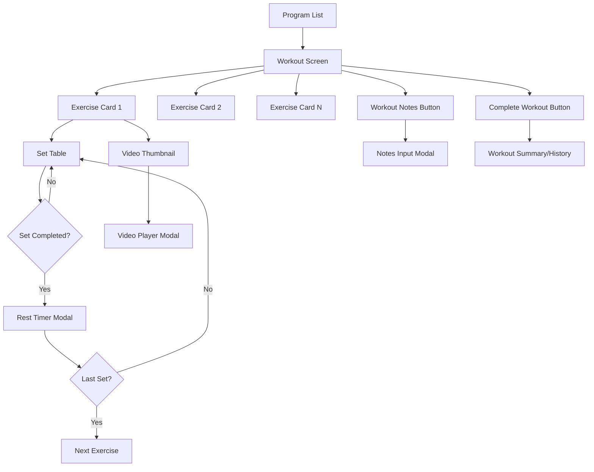
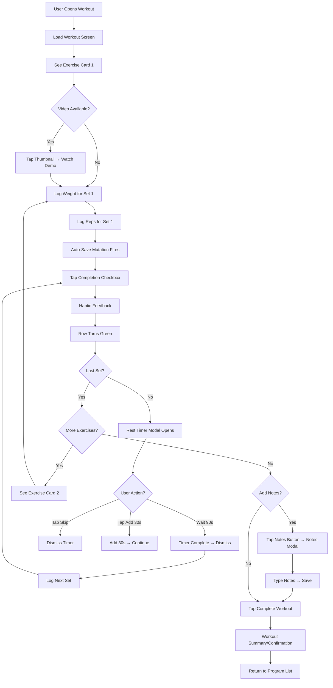

# MindMirror Workout UI - Front-End Specification
## Alpha Validation Initiative

**Document Version:** v1.0
**Last Updated:** 2025-10-15
**UX Designer:** Sally (UX Expert)
**Status:** Ready for Implementation

---

## Table of Contents

1. [Introduction](#1-introduction)
2. [Overall UX Goals & Principles](#2-overall-ux-goals--principles)
3. [Information Architecture](#3-information-architecture)
4. [User Flows](#4-user-flows)
5. [Component Library / Design System](#5-component-library--design-system)
6. [Branding & Style Guide](#6-branding--style-guide)
7. [Accessibility Requirements](#7-accessibility-requirements)
8. [Responsiveness Strategy](#8-responsiveness-strategy)
9. [Animation & Micro-interactions](#9-animation--micro-interactions)
10. [Performance Considerations](#10-performance-considerations)
11. [Next Steps](#11-next-steps)

---

## 1. Introduction

This document defines the user experience goals, information architecture, user flows, and visual design specifications for MindMirror's workout execution interface. It serves as the foundation for frontend development during the 4-week alpha validation period with 3 real users.

**Scope:** This specification focuses exclusively on the workout execution experience (Exercise Card, Set Table, Rest Timer, Notes, Video Player) as defined in PRD Epic 2.

**Related Documents:**
- PRD: `docs/prd.md`
- Design System: `docs/design-system.md`
- Component Specifications: `docs/component-specs.md`
- Project Brief: `docs/brief.md`

**Implementation File:** `mindmirror-mobile/app/(app)/client/[id].tsx`

---

## 2. Overall UX Goals & Principles

### 2.1 Target User Personas

**From PRD Section 1.3:**

1. **Knee Rehab Patient (Age 50+)**
   - **Context:** ACL reconstruction recovery, needs structured progression
   - **UX Needs:** Clear exercise instructions, confidence-building feedback, forgiving error handling
   - **Success Metric:** Completes 3 workouts without confusion or pain flare-ups

2. **AC Dysfunction Desk Worker (Age 30-40)**
   - **Context:** Shoulder pain from poor ergonomics, needs corrective exercises
   - **UX Needs:** Quick workout logging (time-constrained), pain tracking via notes
   - **Success Metric:** Completes 2 workouts, uses notes feature for pain tracking

3. **Combat Athlete (Age 25-35)**
   - **Context:** MMA/BJJ training, needs supplemental strength/conditioning
   - **UX Needs:** Fast set logging (high volume), precise rest timer, minimal friction
   - **Success Metric:** Completes 4 workouts, stress-tests rest timer at high volume

### 2.2 Usability Goals

1. **Ease of Learning:** New users complete first workout within 10 minutes of signup (no tutorial required)
2. **Efficiency of Use:** Logging a single set takes <10 seconds (weight → reps → complete)
3. **Error Prevention:** Auto-save on every modification prevents data loss from accidental navigation
4. **Memorability:** Infrequent users (rehab patients) can return after 1 week without relearning
5. **Delight:** "Date-worthy" visual polish creates excitement to use app vs. pen-and-paper

### 2.3 Design Principles

1. **Clarity over cleverness** - Exercise names and target sets/reps immediately visible, no hunting for info
2. **Minimize cognitive load** - Auto-save eliminates "did I save?" anxiety; completion checkbox immediately shows progress
3. **Immediate feedback** - Optimistic UI updates, haptic feedback on set completion, visual confirmation (green row tint)
4. **Familiar interactions** - Numeric steppers (+/-), modal rest timer, checkbox patterns match Hevy and established fitness app UX
5. **Energetic but grounded** - Teal/indigo color palette feels fresh and motivating without neon chaos

### 2.4 Change Log

| Date | Version | Description | Author |
|------|---------|-------------|--------|
| 2025-10-15 | v1.0 | Initial front-end spec for alpha validation | Sally (UX Expert) |

---

## 3. Information Architecture

### 3.1 Screen Inventory

**Workout Execution Flow (In Scope for Alpha):**

```
Workout Screen (Main)
├── Exercise Cards (repeating)
│   ├── Video Thumbnail → Video Player Modal
│   ├── Exercise Name
│   ├── Target Sets/Reps
│   └── Exercise Notes Accordion (optional)
├── Set Tables (repeating, per exercise)
│   ├── Header Row
│   ├── Data Rows (sets)
│   └── Completion triggers → Rest Timer Modal
├── Workout Notes Button → Notes Input Modal
└── Complete Workout Button
```

**Adjacent Screens (Out of Scope for Alpha UX work):**

- Home/Dashboard (navigation entry point)
- Program List (selects which workout to execute)
- Workout History (view past completed workouts)
- Profile/Settings

### 3.2 Navigation Structure

**Primary Navigation:**
- Bottom tab bar (if exists in app) - not modified for alpha
- Entry point: User navigates from Program List → Workout Screen

**Secondary Navigation:**
- None within workout execution screen (single-page flow)
- Modals for: Video Player, Rest Timer, Notes Input (dismiss to return to workout)

**Breadcrumb Strategy:**
- Not applicable for mobile single-screen workout flow
- Header shows: "← [Program Name] - Workout [Day #]"

### 3.3 Site Map Diagram



---

## 4. User Flows

### 4.1 Complete a Workout (Happy Path)

**User Goal:** Log sets for all prescribed exercises and track workout progress

**Entry Points:**
- User taps workout from Program List screen
- User continues in-progress workout (auto-resume if state persists)

**Success Criteria:**
- All sets logged with weight/reps
- Workout marked complete
- Data auto-saved throughout (no data loss on navigation)

#### Flow Diagram



#### Edge Cases & Error Handling

- **User navigates away mid-workout:** State persists (auto-saved), can resume later
- **Network failure during save:** Queue mutation, show "Offline - will sync" toast, retry on reconnect
- **User logs 0 weight/0 reps:** Allow (represents failure), show warning toast "Set logged with 0 weight/reps"
- **User unchecks completed set:** Remove green tint, allow re-editing weight/reps, fire auto-save
- **App backgrounded during rest timer:** Timer continues, resumes on foreground (use AppState listener)
- **Video fails to load:** Show error in player: "Failed to load video" + [Retry] button

**Notes:** Auto-save fires on every modification (weight change, reps change, set completion, every 15 seconds for duration). This eliminates "forgot to save" anxiety common in alpha testing.

---

### 4.2 Watch Exercise Demo Video

**User Goal:** Understand proper form for an exercise by watching demonstration video

**Entry Points:**
- Tap video thumbnail on Exercise Card
- First-time user encountering unfamiliar exercise

**Success Criteria:**
- Video plays without errors
- User can toggle between short demo (15-30s) and full tutorial (2-5min) if both exist
- User can dismiss and return to workout

#### Flow Diagram

```mermaid
graph TD
    Start[User Taps Video Thumbnail] --> CheckURL{Video URL Exists?}
    CheckURL -->|No| ShowPlaceholder[Show Placeholder Icon + "Video Unavailable"]
    CheckURL -->|Yes| OpenModal[Open Video Player Modal]
    OpenModal --> LoadVideo[Load Video Player]
    LoadVideo --> CheckType{URL Type?}
    CheckType -->|YouTube/Vimeo| WebView[Render in WebView]
    CheckType -->|MP4| NativePlayer[Render in Native Video Player]
    WebView --> AutoPlay[Auto-play Video]
    NativePlayer --> AutoPlay
    AutoPlay --> CheckBoth{Both Short & Long URLs?}
    CheckBoth -->|Yes| ShowToggles[Show Short Demo / Full Tutorial Buttons]
    CheckBoth -->|No| SingleVideo[Show Single Video Only]
    ShowToggles --> WatchShort{User Taps?}
    WatchShort -->|Short Demo| PlayShort[Play Short Video]
    WatchShort -->|Full Tutorial| PlayLong[Play Long Video]
    PlayShort --> UserDone{Done Watching?}
    PlayLong --> UserDone
    SingleVideo --> UserDone
    UserDone -->|Tap Close| Dismiss[Dismiss Modal]
    Dismiss --> ReturnWorkout[Return to Workout Screen]
    UserDone -->|Swipe Down| Dismiss
```

#### Edge Cases & Error Handling

- **No video URL:** Don't open modal (thumbnail shows placeholder icon + "Video unavailable" text)
- **Video load fails:** Show error in player: "Failed to load video" + [Retry] button
- **User rotates device:** Support landscape orientation for better viewing
- **Only short_video_url exists:** Show that video, hide toggle buttons
- **Only long_video_url exists:** Show that video, hide toggle buttons
- **User backgrounds app:** Pause video, resume on foreground

---

### 4.3 Add Workout Notes

**User Goal:** Record qualitative observations about workout (pain, energy, form adjustments)

**Entry Points:**
- Tap "Notes" button in workout screen header (top-right)
- Prompted after completing workout (optional)

**Success Criteria:**
- Notes saved to `workout.notes` field (workout-level, not exercise or set-level)
- Character limit enforced (200 max)
- Notes persist even if user navigates away

#### Flow Diagram

```mermaid
graph TD
    Start[User Taps Notes Button] --> OpenModal[Open Notes Input Modal]
    OpenModal --> ShowInput[Show Multiline Text Input]
    ShowInput --> UserTypes[User Types Notes]
    UserTypes --> CheckLimit{Over 200 Chars?}
    CheckLimit -->|Yes| BlockInput[Prevent Further Typing]
    CheckLimit -->|No| UpdateCounter[Update Character Counter]
    UpdateCounter --> ChangeColor{Approaching Limit?}
    ChangeColor -->|180-195| Orange[Counter Turns Orange]
    ChangeColor -->|196-200| Red[Counter Turns Red]
    ChangeColor -->|0-179| Gray[Counter Stays Gray]
    Orange --> UserAction{User Action?}
    Red --> UserAction
    Gray --> UserAction
    UserAction -->|Tap Save| CheckEmpty{Notes Empty?}
    CheckEmpty -->|Yes| DisableSave[Save Button Disabled]
    CheckEmpty -->|No| SaveNotes[Fire Save Mutation]
    SaveNotes --> ShowToast[Show Toast: "Notes Saved"]
    ShowToast --> Dismiss[Dismiss Modal]
    Dismiss --> ReturnWorkout[Return to Workout Screen]
    UserAction -->|Tap Cancel| CheckText{Text Entered?}
    CheckText -->|Yes| ConfirmDiscard[Show Alert: "Discard Notes?"]
    ConfirmDiscard --> UserConfirm{User Choice?}
    UserConfirm -->|Discard| Dismiss
    UserConfirm -->|Cancel| ShowInput
    CheckText -->|No| Dismiss
    UserAction -->|Tap Back Arrow| CheckText
```

#### Edge Cases & Error Handling

- **User dismisses modal with unsaved text:** Show confirmation: "Discard notes?" [Cancel] [Discard]
- **User exceeds 200 characters:** Hard limit enforced by `maxLength` prop (cannot type more)
- **Empty notes field:** Save button disabled (40% opacity, non-interactive)
- **Network failure:** Show toast "Failed to save notes. Try again." Keep modal open, allow retry
- **User opens notes modal multiple times:** Pre-populate with previously saved notes (edit mode)

---

## 5. Component Library / Design System

### 5.1 Design System Approach

**Strategy:** Custom design system built for MindMirror, inspired by Hevy's clean aesthetic but distinct in color palette and micro-interactions.

**Foundation Documents:**
- **Full Design System:** `docs/design-system.md` (colors, typography, spacing, primitives)
- **Component Specifications:** `docs/component-specs.md` (detailed layouts, states, edge cases)

**Technology Stack:**
- React Native (Expo)
- TypeScript
- Design tokens in `src/theme/constants.ts` (code-ready constants)

**Key Differentiation from Hevy:**
- **Color Palette:** Teal/turquoise primary (vs. Hevy's blue) for fresh, energetic feel
- **Dark Mode:** Indigo-blue primary with true black (#121212) backgrounds for OLED optimization
- **Accent Colors:** Orange-red (light mode), yellow-orange (dark mode) for celebration moments
- **Micro-interactions:** Haptic feedback at rest timer milestones, spring physics on modals

---

### 5.2 Core Components

#### Component 1: Exercise Card

**Purpose:** Display exercise information and provide entry point to video demonstration

**Variants:**
- Default (with video thumbnail)
- No video (placeholder icon)
- With exercise notes (collapsed accordion)
- Without exercise notes (no accordion)

**States:**
- Default
- Video thumbnail loading (skeleton shimmer)
- Video load error (error icon + message)
- Notes accordion collapsed
- Notes accordion expanded

**Usage Guidelines:**
- One card per exercise in workout
- 24px spacing between cards
- Always show exercise name + target sets/reps
- Video thumbnail is optional but recommended
- Exercise notes accordion only if notes exist in program data

**Detailed Spec:** See `docs/component-specs.md` Section 1

---

#### Component 2: Set Table

**Purpose:** Allow users to log weight, reps, and completion status for each prescribed set

**Variants:**
- Default table (5 columns: Set #, Target, Weight, Reps, Checkbox)
- Simplified for alpha (no "Previous" column - deferred to post-alpha)

**States:**
- Row default (uncompleted, white/dark background)
- Row completed (green tint background)
- Input focused (teal/indigo border)
- Input error (red border, if validation fails)
- Checkbox unchecked
- Checkbox checked (filled with primary color, white checkmark)

**Usage Guidelines:**
- One table per exercise
- Minimum 48px row height (ensures 44px touch target)
- Auto-advance focus: Weight → Reps → Checkbox (keyboard flow)
- Completion checkbox triggers haptic feedback + row tint animation + rest timer modal (if not last set)
- Auto-save fires on every weight/reps change (debounced 500ms)

**Detailed Spec:** See `docs/component-specs.md` Section 2

---

#### Component 3: Rest Timer Modal

**Purpose:** Enforce rest periods between sets with visual countdown and user control

**Variants:**
- Default 90-second timer (configurable)
- Extended timer (user taps "Add 30s" multiple times)

**States:**
- Countdown in progress (90-11 seconds: teal/indigo ring)
- Warning state (10-6 seconds: orange ring + medium haptic)
- Urgency state (5-1 seconds: red ring + medium haptic)
- Complete state (0 seconds: green ring + heavy haptic + auto-dismiss after 2s)

**Usage Guidelines:**
- Triggered automatically when user completes a set (checkbox checked)
- NOT triggered on last set of exercise (no rest needed)
- User cannot dismiss by tapping outside modal (force interaction with Skip button)
- "Add 30s" button can be tapped unlimited times (some users prefer long rest periods)
- Timer continues if app backgrounded (use AppState listener)

**Detailed Spec:** See `docs/component-specs.md` Section 3

---

#### Component 4: Notes Input Modal

**Purpose:** Allow users to add qualitative observations about entire workout

**Variants:**
- Mobile (full-screen modal)
- Tablet (60% width, centered modal)

**States:**
- Empty input (Save button disabled)
- Text entered (Save button enabled)
- Approaching limit (181-195 chars: orange counter)
- At limit (196-200 chars: red counter)
- Saving (loading spinner on Save button)
- Save success (toast notification + dismiss)
- Save error (toast error + modal stays open)

**Usage Guidelines:**
- Accessible via "Notes" button in workout screen header (top-right)
- Notes saved at workout level (not exercise or set-level)
- 200 character hard limit (enforced by `maxLength` prop)
- Pre-populates with existing notes if user opens modal multiple times
- Confirmation dialog if user dismisses with unsaved text

**Detailed Spec:** See `docs/component-specs.md` Section 4

---

#### Component 5: Video Player Modal

**Purpose:** Display exercise demonstration videos (YouTube/Vimeo embeds or MP4s)

**Variants:**
- YouTube/Vimeo embed (WebView)
- MP4 direct URL (native Video player)
- Mobile (full-screen)
- Tablet (80% width, centered, 16:9 aspect ratio)

**States:**
- Loading video (spinner)
- Playing video
- Paused video
- Video error (error message + Retry button)
- Short demo active (toggle button highlighted)
- Full tutorial active (toggle button highlighted)

**Usage Guidelines:**
- Triggered by tapping video thumbnail on Exercise Card
- Close button (top-right) always visible over video
- If both `short_video_url` and `long_video_url` exist: show toggle buttons below video
- If only one URL exists: hide toggle buttons
- Support landscape orientation on mobile for better viewing
- Auto-play on modal open (no additional tap required)

**Detailed Spec:** See `docs/component-specs.md` Section 5

---

## 6. Branding & Style Guide

### 6.1 Visual Identity

**Brand Guidelines:** MindMirror is a performance platform for mind and body optimization. Visual identity should convey energy, focus, and approachability (not clinical or overly technical).

**Design Philosophy:** "Energetic but grounded" - directional energy (focused, intentional) rather than diffuse chaos. Think fitness, flow, movement, water (teal/turquoise associations).

---

### 6.2 Color Palette

#### Light Mode

| Color Type | Hex Code | Usage |
|------------|----------|-------|
| **Primary** | #00BCD4 | Buttons, links, active states, rest timer progress ring |
| **Primary Hover** | #0097A7 | Button hover states |
| **Primary Pressed** | #00838F | Button pressed states |
| **Accent** | #FF5722 | PR badges, milestone celebrations, high-urgency CTAs |
| **Success** | #4CAF50 | Completed set row tint, rest timer completion, workout complete confetti |
| **Warning** | #FF9800 | Rest timer <10s, form warnings, approaching failure |
| **Error** | #F44336 | Validation errors, network failures, data loss warnings |
| **Background** | #FFFFFF | Main screen background |
| **Background Elevated** | #F5F5F5 | Exercise cards, modals (subtle elevation) |
| **Background Subtle** | #ECEFF1 | Table header row, input backgrounds |
| **Border** | #CFD8DC | Card borders, input borders, dividers |
| **Text Primary** | #212121 | Exercise names, set data, body text (16.1:1 contrast) |
| **Text Secondary** | #616161 | Labels, timestamps, helper text (7.3:1 contrast) |
| **Text Tertiary** | #9E9E9E | Placeholders, disabled states (4.7:1 contrast) |

#### Dark Mode

| Color Type | Hex Code | Usage |
|------------|----------|-------|
| **Primary** | #5C6BC0 | Buttons, links, active states, rest timer progress ring |
| **Primary Hover** | #7986CB | Button hover states (lighter in dark mode) |
| **Primary Pressed** | #3949AB | Button pressed states |
| **Accent** | #FFB300 | PR badges, milestone celebrations (warmer glow vs. light mode) |
| **Success** | #66BB6A | Completed set row tint, rest timer completion |
| **Warning** | #FFA726 | Rest timer <10s, form warnings |
| **Error** | #EF5350 | Validation errors, network failures |
| **Background** | #121212 | Main screen background (true dark, OLED-friendly) |
| **Background Elevated** | #1E1E1E | Exercise cards, modals (subtle 2dp elevation) |
| **Background Subtle** | #2C2C2C | Table header row, input backgrounds |
| **Border** | #3A3A3A | Card borders, input borders, dividers |
| **Text Primary** | #FFFFFF | Exercise names, set data, body text (21:1 contrast) |
| **Text Secondary** | #B0B0B0 | Labels, timestamps, helper text (12.6:1 contrast) |
| **Text Tertiary** | #757575 | Placeholders, disabled states (4.6:1 contrast) |

**Color Psychology:**
- **Teal/Turquoise (Light):** Water, movement, flow, energy, freshness - fitness-focused without being aggressive
- **Indigo/Blue (Dark):** Calm confidence, focus, premium feel - grounded sophistication
- **Orange-Red Accent (Light):** Warmth, urgency, celebration - pops against white
- **Yellow-Orange Accent (Dark):** Warmer glow, energetic without harshness against dark backgrounds

---

### 6.3 Typography

#### Font Families

- **Primary (iOS):** SF Pro Display, SF Pro Text (system default)
- **Primary (Android):** Roboto, Noto Sans (system default)
- **Monospace:** Not used in this interface (future consideration for workout timers)

#### Type Scale

| Element | Size | Weight | Line Height | Usage |
|---------|------|--------|-------------|-------|
| **Display** | 24px | 700 (Bold) | 32px | Exercise names, screen titles |
| **Title** | 18px | 600 (Semibold) | 24px | Section headers, modal titles ("Rest Timer", "Workout Notes") |
| **Body** | 16px | 400 (Regular) | 24px | Set data, labels, default text |
| **Body Small** | 14px | 400 (Regular) | 20px | Helper text, metadata, target sets/reps |
| **Caption** | 12px | 400 (Regular) | 16px | Timestamps, character counter |
| **Button** | 16px | 600 (Semibold) | 24px | Button text (no all-caps) |

**Letter Spacing:**
- Display: -0.5px (slight tightening for large text)
- Title: -0.25px
- Body/Small/Caption: 0px (default)
- Button: +0.5px (slight spacing for clarity)

---

### 6.4 Iconography

**Icon Library:** React Native Vector Icons (Ionicons, Feather, or MaterialCommunityIcons)

**Usage Guidelines:**
- Icon size: 24px default, 18px for small contexts (stepper buttons), 32px for large (close button)
- Icon color: Match text color in context (primary icons use textPrimary, secondary use textSecondary)
- Always pair with `accessibilityLabel` for screen readers
- Common icons:
  - Close: `X` or `close` (modal dismiss)
  - Play: `play-circle` (video thumbnail)
  - Plus/Minus: `+` / `-` (numeric steppers)
  - Checkmark: `checkmark` (completion checkbox)
  - Note: `document-text` or `clipboard` (notes button)

---

### 6.5 Spacing & Layout

#### Spacing Scale (4px Grid)

- **xs:** 4px - Tight spacing (icon + text, badge padding)
- **sm:** 8px - Related elements (set number + weight input, table cell padding)
- **md:** 16px - Standard padding (card padding, button padding, default component spacing)
- **lg:** 24px - Section spacing (between exercise cards)
- **xl:** 32px - Large gaps (screen edges, modal top/bottom padding)
- **xxl:** 48px - Extra large (modal to screen edge on tablets, empty state spacing)

#### Grid System

**Mobile:** Single column layout (full width minus 16px margins)
**Tablet:** Centered content with max-width 768px (for modals: 60% width, max 600px)

#### Special Spacing

- **Table row height:** 48px (ensures 44px minimum touch target + 4px padding)
- **Button minimum height:** 44px (iOS), 48px (Android)
- **Card border radius:** 12px (modern, friendly)
- **Input border radius:** 8px (slightly softer than cards)
- **Modal border radius:** 16px (larger for prominence)

---

## 7. Accessibility Requirements

### 7.1 Compliance Target

**Standard:** WCAG 2.1 Level AA (minimum requirement for alpha, AAA for critical text)

**Rationale:** Alpha users include 50+ age rehab patient who may have vision impairments. High contrast and clear focus indicators are non-negotiable.

---

### 7.2 Key Requirements

#### Visual

- **Color contrast ratios:**
  - Body text (16px): 4.5:1 minimum ✅ (Light: 16.1:1, Dark: 21:1)
  - Large text (24px+): 3:1 minimum ✅ (exceeds at 16:1+)
  - UI components: 3:1 minimum ✅ (borders, icons meet threshold)

- **Focus indicators:**
  - 2px solid border in primary color (#00BCD4 light, #5C6BC0 dark)
  - Visible on all interactive elements (inputs, buttons, checkboxes)
  - Minimum 2px offset from element edge

- **Text sizing:**
  - Base font size: 16px (prevents iOS auto-zoom on input focus)
  - Support system font scaling (user can increase text size in OS settings)
  - No text smaller than 12px (caption text only)

#### Interaction

- **Keyboard navigation:**
  - Tab order follows visual order: Set # → Weight → Reps → Checkbox → Next set
  - All interactive elements keyboard accessible
  - Focus visible at all times (primary color border)

- **Screen reader support:**
  - All icons have `accessibilityLabel` (e.g., "Increase weight", "Mark set complete")
  - Images have alt text (e.g., "Demo for Barbell Back Squat")
  - Headings use proper hierarchy (H1 for exercise names, H2 for section headers)
  - Dynamic content changes announced (e.g., "Set 1 completed" when checkbox checked)

- **Touch targets:**
  - Minimum 44px × 44px (iOS guideline)
  - Minimum 48px × 48px (Android guideline)
  - Stepper buttons: 32px × 32px (acceptable for secondary actions, within larger touch area)
  - Table rows: 48px minimum height

#### Content

- **Alternative text:**
  - Video thumbnails: "Watch demo for [exercise name]"
  - Placeholder icons: "Video unavailable"
  - Checkmark icon: "Completed" (when checked)

- **Heading structure:**
  - Exercise names: H1 (semantic hierarchy)
  - Modal titles: H2 ("Rest Timer", "Workout Notes")
  - Section headers: H3 (if applicable)

- **Form labels:**
  - Numeric inputs: "Weight for set 1", "Reps for set 1" (visible or aria-label)
  - Notes input: "Workout notes" (visible label in modal header)

---

### 7.3 Testing Strategy

**Manual Testing:**
- Test with iOS VoiceOver on every PR with UI changes
- Test with Android TalkBack on final QA before alpha launch
- Keyboard navigation test (external keyboard on iPad/Android tablet)
- Test with 200% system font size (iOS/Android accessibility settings)

**Automated Testing:**
- Use `@testing-library/react-native` with accessibility queries
- Lint with `eslint-plugin-jsx-a11y` for React Native
- Contrast checker: https://webaim.org/resources/contrastchecker/

**Alpha User Testing:**
- Ask 50+ age rehab patient for specific feedback on text readability and button sizes
- Monitor for any "I couldn't find X" or "I couldn't tap Y" feedback (indicates accessibility issue)

---

## 8. Responsiveness Strategy

### 8.1 Breakpoints

| Breakpoint | Min Width | Max Width | Target Devices | Adaptation Strategy |
|------------|-----------|-----------|----------------|---------------------|
| **Mobile** | 320px | 767px | iPhone SE to iPhone 15 Pro Max, Android phones | Single column, full-width components, mobile-optimized modals (full-screen) |
| **Tablet** | 768px | 1024px | iPad, iPad Pro, Android tablets | Centered content (max-width 768px), modals at 60-80% width, landscape-friendly video player |
| **Desktop** | 1025px+ | - | Not primary target for alpha | Content max-width 1200px, centered, same layout as tablet |

**Note:** Alpha validation focuses on mobile (React Native app). Tablet support is secondary but should be tested on iPad if alpha user has one.

---

### 8.2 Adaptation Patterns

#### Layout Changes

**Mobile:**
- Exercise cards: Full width (minus 16px margins)
- Set table: Horizontal scroll if columns exceed viewport width (unlikely with 5 columns)
- Modals: Full-screen (Notes Input, Video Player)

**Tablet:**
- Exercise cards: Max-width 768px, centered
- Set table: Same layout, more breathing room
- Modals: 60% width (Notes Input), 80% width (Video Player), centered with dark overlay

#### Navigation Changes

- No navigation changes (single-screen workout flow)
- Header remains fixed at top (program name + notes button)

#### Content Priority

**Mobile:**
- Prioritize set table visibility (most critical interaction)
- Exercise cards scrollable (vertical list)
- Modals take full focus (full-screen overlay)

**Tablet:**
- Same priority, but more content visible at once
- Side-by-side view possible in landscape (future enhancement, not alpha)

#### Interaction Changes

**Mobile:**
- Touch-optimized (44px+ touch targets)
- Swipe-to-dismiss on modals (optional, iOS gesture)

**Tablet:**
- Same touch targets (some users may use external keyboard/mouse)
- Keyboard navigation fully supported

---

## 9. Animation & Micro-interactions

### 9.1 Motion Principles

1. **Purposeful motion** - Every animation serves a functional purpose (provide feedback, guide attention, or reduce perceived latency)
2. **Respect user preferences** - Honor `prefers-reduced-motion` setting (disable non-essential animations)
3. **Performance-first** - Use GPU-accelerated properties only (transform, opacity - avoid animating layout properties)
4. **Consistent easing** - Use React Native Reanimated spring physics for natural feel

---

### 9.2 Key Animations

| Animation Name | Description | Duration | Easing |
|----------------|-------------|----------|--------|
| **Modal Slide-Up** | Modals enter from bottom, slide up to center | 300ms | Spring (damping 0.8, stiffness 100) |
| **Modal Fade-In** | Overlay background fades in behind modal | 250ms | Ease-in-out |
| **Row Background Tint** | Set row background changes to green on completion | 250ms | Ease-in-out |
| **Button Press** | Button scales down slightly on press | 150ms | Ease-in-out (scale 0.98) |
| **Checkbox Fill** | Checkbox border → filled with primary color when checked | 200ms | Ease-in-out |
| **Rest Timer Progress Ring** | Circular ring depletes from 100% → 0% over timer duration | Linear (90s default) | Linear |
| **Accordion Expand** | Exercise notes accordion expands with smooth height animation | 250ms | Ease-in-out |
| **Skeleton Shimmer** | Video thumbnail loading shimmer (left-to-right gradient) | 1500ms | Linear, infinite loop |

**Code Example (React Native Reanimated):**

```typescript
import Animated, { useAnimatedStyle, withSpring } from 'react-native-reanimated';

// Button press animation
const animatedStyle = useAnimatedStyle(() => ({
  transform: [{ scale: withSpring(pressed ? 0.98 : 1, { damping: 10 }) }],
}));
```

---

### 9.3 Haptic Feedback

| Trigger Event | Haptic Type | Rationale |
|---------------|-------------|-----------|
| **Set completion checkbox checked** | Light impact | Subtle confirmation, doesn't interrupt flow |
| **Rest timer 10s remaining** | Medium impact | Alert user to upcoming timer end |
| **Rest timer 5s remaining** | Medium impact | Reinforce urgency |
| **Rest timer complete (0s)** | Heavy impact | Strong feedback for milestone completion |
| **PR achieved (future)** | Heavy impact | Celebration moment |

**Implementation:**

```typescript
import * as Haptics from 'expo-haptics';

// Light impact (checkbox)
Haptics.impactAsync(Haptics.ImpactFeedbackStyle.Light);

// Medium impact (timer warnings)
Haptics.impactAsync(Haptics.ImpactFeedbackStyle.Medium);

// Heavy impact (timer complete, PR)
Haptics.impactAsync(Haptics.ImpactFeedbackStyle.Heavy);
```

---

## 10. Performance Considerations

### 10.1 Performance Goals

- **Page Load:** Workout screen loads within 2 seconds on 4G network (p95 metric)
- **Interaction Response:** Set logging interactions respond within 200ms (optimistic UI updates, no spinners)
- **Animation FPS:** All animations maintain 60 FPS on iPhone X / Pixel 5 or newer

### 10.2 Design Strategies

**Optimistic UI Updates:**
- User logs weight → UI updates immediately, mutation fires in background
- If mutation fails → Show toast, revert UI (or queue for retry)
- No loading spinners on set logging (feels instant)

**Virtualized Lists:**
- If program has >10 sets per exercise, use `FlatList` with virtualization (render only visible rows)
- Exercise cards also virtualized if program has >5 exercises

**Image Optimization:**
- Video thumbnails: Low-res poster frames (not full video files)
- Lazy load video player (only load YouTube/Vimeo embed when modal opens)

**Debouncing:**
- Weight/reps text inputs: Debounce auto-save by 500ms (don't fire mutation on every keystroke)
- Duration auto-save: Fire every 15 seconds (not every second)

**Background Sync:**
- Queue failed mutations in AsyncStorage
- Retry on network reconnect (don't block UI)

---

### 10.3 Monitoring

**Metrics to Track (Alpha):**
- Time-to-interactive (TTI) for workout screen load
- Mutation success rate (auto-save reliability)
- Network failure rate (offline queue usage)

**Tools:**
- React Native Performance Monitor (built-in, enable in dev mode)
- Sentry for error tracking (optional, post-alpha)
- Custom telemetry for mutation timing (if needed)

---

## 11. Next Steps

### 11.1 Immediate Actions

1. **Review with Stakeholders**
   - PM reviews PRD alignment
   - Backend engineer reviews auto-save mutation requirements
   - Product designer (if exists) reviews visual polish goals

2. **Create/Update Visual Designs**
   - No Figma mockups required for alpha (component specs are sufficient)
   - If time allows: Create high-fidelity mockups in Figma for stakeholder buy-in
   - Screenshots of Hevy UI serve as visual reference (already provided)

3. **Prepare for Handoff to Frontend Engineer**
   - Share this document + Design System + Component Specs
   - Engineer creates `src/theme/constants.ts` from design system export
   - Engineer implements components following specs

4. **Backend Requirements Confirmation**
   - Does `workout.notes` field exist in `practice_instance` model?
   - Does `updateWorkoutSet` mutation exist? Does it handle partial updates?
   - Does `practice_instance` have `duration` field for elapsed time tracking?
   - If not: Backend engineer needs to create migrations + GraphQL mutations

---

### 11.2 Design Handoff Checklist

- [x] All user flows documented (Complete Workout, Watch Video, Add Notes)
- [x] Component inventory complete (5 components: Exercise Card, Set Table, Rest Timer, Notes Modal, Video Player)
- [x] Accessibility requirements defined (WCAG AA, contrast ratios, touch targets)
- [x] Responsive strategy clear (Mobile-first, tablet support, breakpoints defined)
- [x] Brand guidelines incorporated (Teal/indigo palette, energetic but grounded philosophy)
- [x] Performance goals established (<2s load, <200ms interaction, 60 FPS animations)

---

### 11.3 Implementation Timeline

**Estimated Effort:** 11-14 hours (within 8-14 hour UX budget on higher end, includes testing/QA)

| Phase | Tasks | Hours |
|-------|-------|-------|
| **Phase 1: Foundation** | Design system setup, theme context | 1-2 |
| **Phase 2: Exercise Card** | Card layout, video thumbnail, accordion | 2-3 |
| **Phase 3: Set Table** | Table layout, steppers, auto-save wiring | 3-4 |
| **Phase 4: Rest Timer** | Circular progress, haptics, buttons | 2 |
| **Phase 5: Modals** | Notes input, video player | 1.5 |
| **Phase 6: Polish & QA** | Auto-save queue, offline handling, testing | 1-2 |

**Start Date:** TBD (after backend requirements confirmed)
**Target Completion:** Day 5 of Week 1 (per PRD timeline)
**QA:** UX expert reviews implemented UI against Hevy screenshots + component specs

---

### 11.4 Open Questions & Decisions Needed

**Backend Blockers:**
1. **`workout.notes` field** - Exists? If not, needs migration + GraphQL mutation
2. **Auto-save mutations** - `updateWorkoutSet` mutation exists? Handles partial updates (weight only, reps only)?
3. **Duration tracking** - `practice_instance` has `duration` field? If not, add migration
4. **Historical data query** - Do we need "previous workout" data for post-alpha? (Deferred for now, but confirm schema supports it)

**UX Decisions:**
- ✅ Auto-save strategy: Option A confirmed (save on every modification)
- ✅ Notes scope: Workout-level only (not exercise or set-level)
- ✅ Set table columns: Simplified (no "Previous" column for alpha)
- ✅ Video player: Use existing short/long URLs (YouTube/Vimeo/MP4)
- ✅ Color palette: Teal/indigo confirmed, orange-red/yellow-orange accents

**Post-Alpha Enhancements:**
- Add "Previous" column to set table (show historical data for progression tracking)
- Exercise-level and set-level notes (more granular qualitative tracking)
- Dark mode toggle in app settings (currently respects system preference)
- Animation refinements based on alpha user feedback
- Performance optimizations based on real-world network conditions

---

## 12. Appendix

### 12.1 Related Documents

- **PRD:** `docs/prd.md` - Product Requirements Document with full epic/story breakdown
- **Design System:** `docs/design-system.md` - Complete color palette, typography, spacing, component primitives
- **Component Specifications:** `docs/component-specs.md` - Detailed layouts, states, edge cases, testing scenarios
- **Project Brief:** `docs/brief.md` - High-level project context and goals
- **Alpha Validation Strategy:** `docs/alpha-validation-week-1.md` - 3 user profiles, timeline, success metrics

### 12.2 Design Tools & Resources

- **Hevy App Screenshots:** Provided as visual reference (see PRD Section 3 for URLs)
- **Color Contrast Checker:** https://webaim.org/resources/contrastchecker/
- **React Native Reanimated Docs:** https://docs.swmansion.com/react-native-reanimated/
- **Expo Haptics Docs:** https://docs.expo.dev/versions/latest/sdk/haptics/
- **WCAG 2.1 Guidelines:** https://www.w3.org/WAI/WCAG21/quickref/

### 12.3 Glossary

- **Optimistic UI:** UI updates immediately before server confirmation, assuming success
- **Haptic Feedback:** Physical vibration/tap feedback from device (enhances tactile interaction)
- **Debouncing:** Delaying action until user stops typing/interacting (prevents excessive API calls)
- **Virtualization:** Rendering only visible list items (improves performance for long lists)
- **Spring Physics:** Natural-feeling animation easing that mimics real-world motion
- **WCAG AA:** Web Content Accessibility Guidelines Level AA (industry standard for accessibility)

---

**End of Front-End Specification**

*For questions or clarification, contact UX Expert Sally or reference the Design System and Component Specifications documents.*
