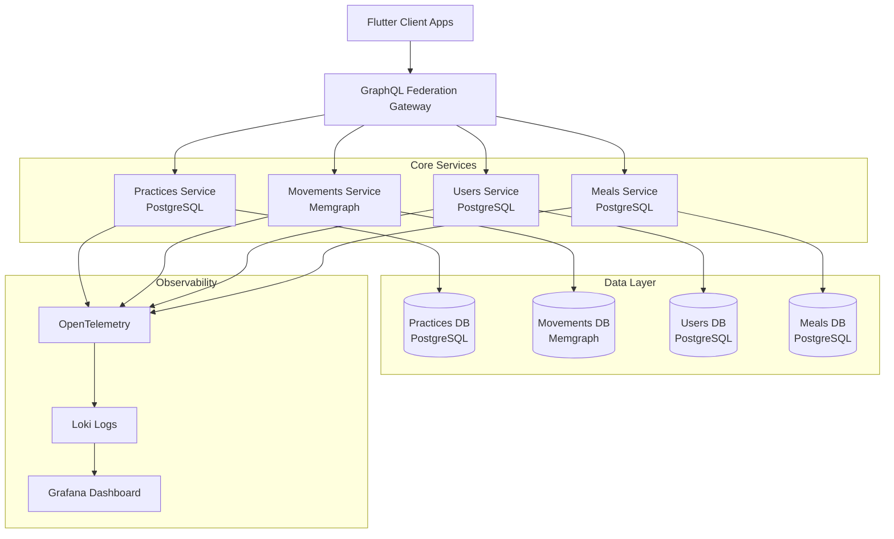
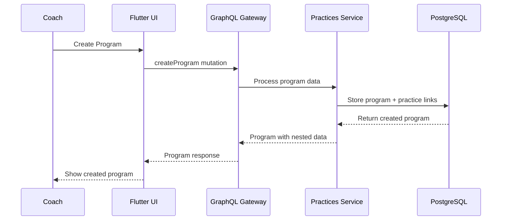
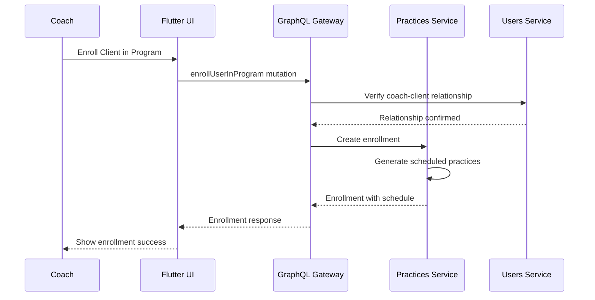
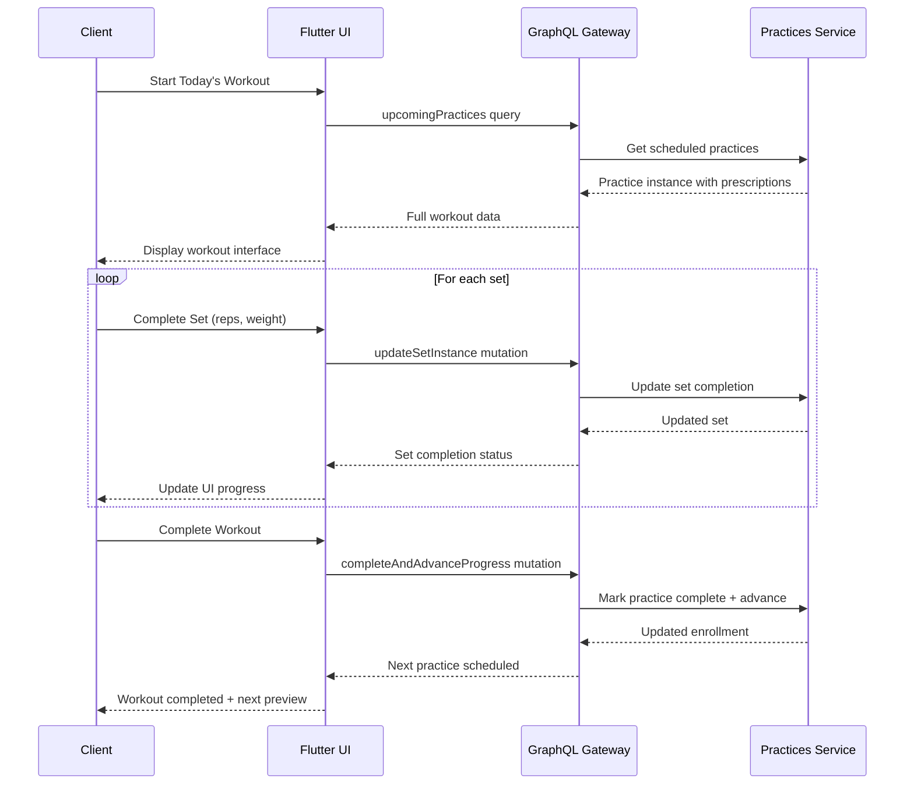
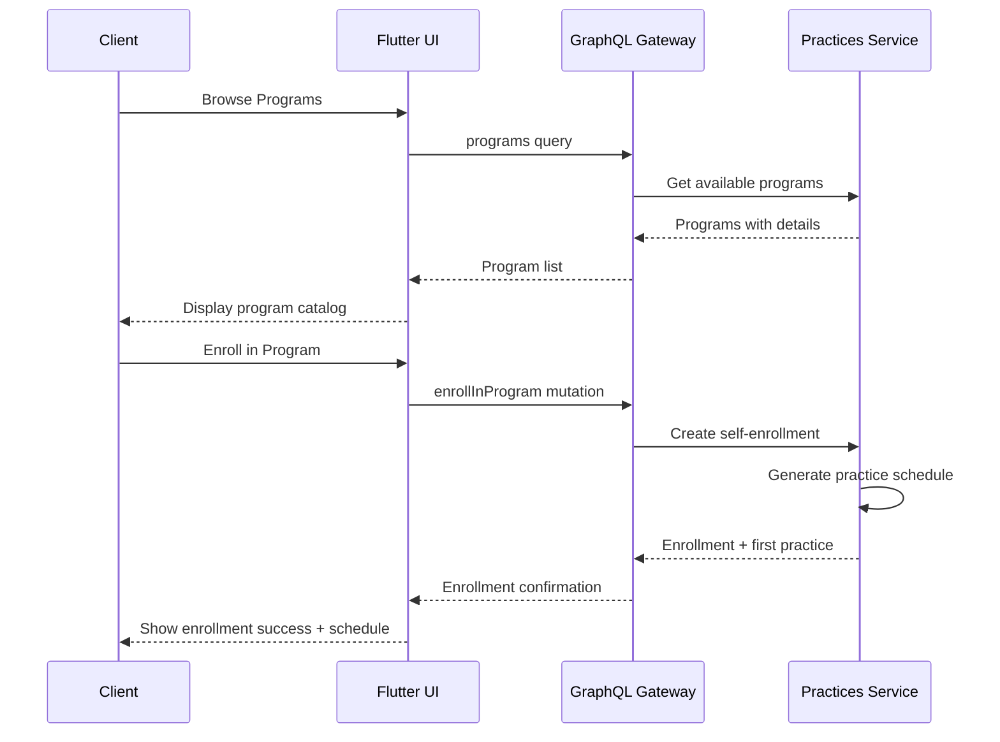
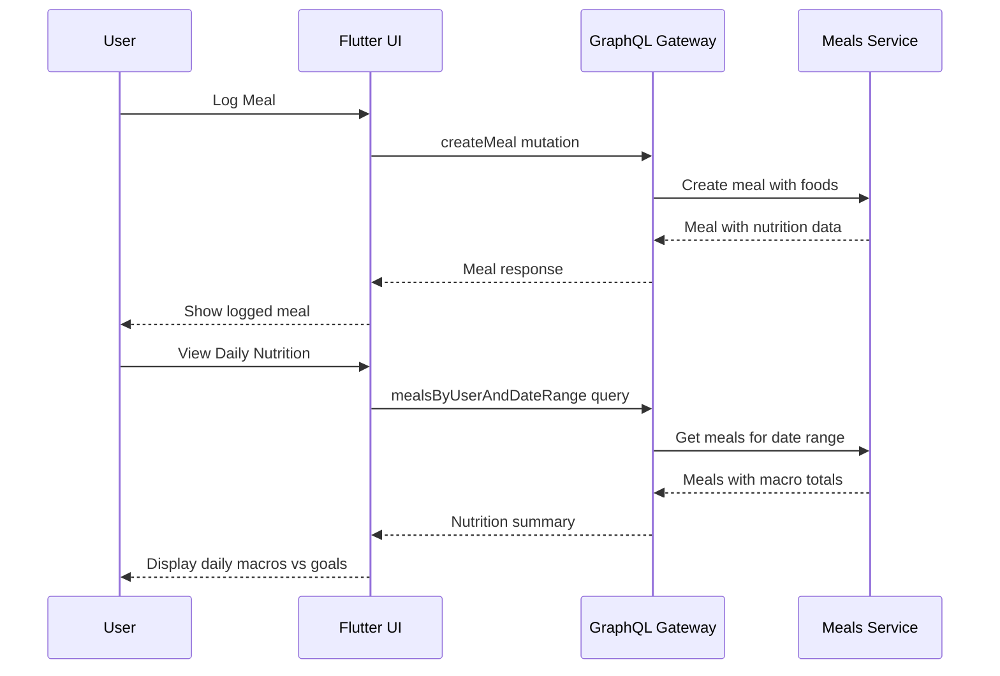
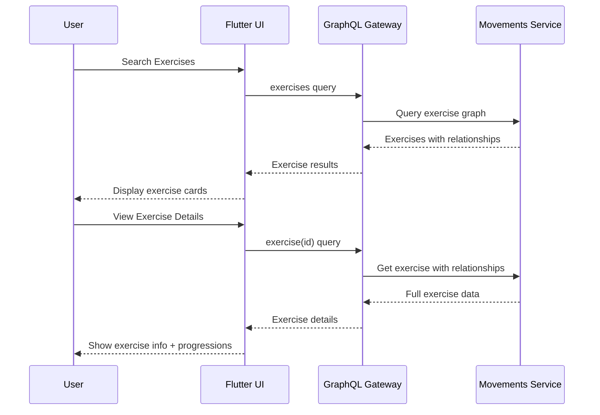

# 🏗️ Swae OS - Comprehensive Fitness Platform

## 🎯 Product Overview

**Swae OS** is a modern, scalable fitness platform that revolutionizes how coaches and clients interact with workout programming, nutrition tracking, and fitness management. Built with a microservices architecture and Flutter frontend, it provides a seamless experience across web, iOS, and Android platforms.

### 🎯 Core Value Propositions

**For Fitness Coaches:**
- Create reusable workout templates with detailed exercise prescriptions
- Manage client relationships and program assignments
- Track client progress and workout completion
- Build comprehensive fitness programs with structured progressions

**For Fitness Clients:**
- Access personalized workout programs from certified coaches
- Track workouts in real-time with set-by-set logging
- Manage nutrition with comprehensive meal and macro tracking
- Defer and reschedule workouts with flexible scheduling

**For Fitness Enthusiasts:**
- Create and track standalone workouts
- Access comprehensive exercise database with movement relationships
- Self-enroll in available fitness programs
- Track progress across multiple fitness domains

## 🏛️ System Architecture

### 🔄 Microservices Architecture



### 🧩 Service Responsibilities

#### 🏃‍♂️ Practices Service
**Domain:** Workout management, program enrollment, coaching relationships
- **Template/Instance Pattern:** Reusable templates → executable instances
- **Hierarchical Structure:** Programs → Practices → Prescriptions → Movements → Sets
- **Core Entities:** Practice Templates/Instances, Program Enrollments, Scheduled Practices
- **Authorization:** Role-based (Coach/Client) with relationship verification

#### 💪 Movements Service  
**Domain:** Exercise database and movement relationships
- **Graph Database:** Memgraph for complex exercise relationships
- **Core Entities:** Exercises, Equipment, Archetypes, Progressions/Regressions
- **Relationships:** Exercise progressions, equipment requirements, movement patterns

#### 👥 Users Service
**Domain:** User management, authentication, service subscriptions
- **Core Entities:** Users, Roles, Coach-Client Associations, Service Links
- **Integration:** Supabase authentication, Keycloak identity management
- **Authorization:** Role-based access control across all services

#### 🍽️ Meals Service
**Domain:** Nutrition tracking and meal management
- **Core Entities:** Meals, Food Items, Water Consumption, User Goals
- **Features:** Macro tracking, meal planning, nutrition goal management

### 🔀 GraphQL Federation Gateway
- **Unified API:** Single GraphQL endpoint for all client applications
- **Service Composition:** Automatic schema stitching and data aggregation
- **Type Federation:** Shared types across services (Exercise, User references)
- **Performance:** Query optimization and caching

## 📱 Frontend Architecture

### 🎨 Flutter Application
- **Cross-Platform:** Web, iOS, Android from single codebase
- **State Management:** Riverpod for reactive state management
- **Code Generation:** Freezed for immutable models, Build Runner for GraphQL
- **Architecture:** Clean architecture with domain/data/presentation layers

### 🔧 Key Features

#### 🏋️‍♂️ Workout Management
- **Real-time Tracking:** Set-by-set workout logging with completion status
- **Template System:** Reusable workout templates for coaches
- **Program Enrollment:** Client subscription to coach-designed programs
- **Progress Tracking:** Automatic advancement through program sequences

#### 📊 Comprehensive Analytics
- **Workout Analytics:** Completion rates, progress tracking, performance metrics
- **Nutrition Analytics:** Macro tracking, calorie goals, meal analysis
- **Program Analytics:** Enrollment statistics, completion rates

#### 🤝 Coach-Client Relationships
- **Verified Associations:** Secure coach-client relationship management
- **Program Assignment:** Coaches assign programs to specific clients
- **Progress Monitoring:** Coaches track client workout completion and progress

## 🗂️ Data Architecture

### 📋 Template vs Instance Pattern

The system uses a sophisticated **Template/Instance** pattern for workout management:

**Templates** (Design Phase - Coaches/Users):
```
PracticeTemplate
├── PrescriptionTemplate (Warmup/Workout/Cooldown)
    ├── MovementTemplate (Exercise with parameters)
        └── SetTemplate (Reps/Weight/Duration specifications)
```

**Instances** (Execution Phase - Clients):
```
PracticeInstance (Actual workout)
├── PrescriptionInstance (Executed prescription)
    ├── MovementInstance (Performed movement)
        └── SetInstance (Completed set with actual values)
```

This separation enables:
- **Reusability:** Templates can generate multiple instances
- **Customization:** Instances can be modified without affecting templates
- **Progress Tracking:** Actual performance vs. prescribed parameters
- **Data Integrity:** Template changes don't affect historical data

### 🔐 Authorization Model

**Role-Based Access Control:**
- **Coaches:** Create templates, manage client relationships, assign programs
- **Clients:** Execute workouts, modify their instances, enroll in programs
- **Relationship Verification:** Coaches can only manage their verified clients

**Permission Matrix:**
| Entity | Coach (Own) | Coach (Client) | Client (Own) | Client (Other) |
|--------|-------------|----------------|--------------|----------------|
| Templates | CRUD | Read | Read | Read |
| Instances | Read | Read | CRUD | None |
| Programs | CRUD | Assign | Enroll | Read |
| Enrollments | Read | CRUD | CRUD (own) | None |

## 🚀 USER FLOWS

### 👨‍🏫 Coach Workflow

#### 1. Program Creation Flow


**GraphQL Operations:**
```graphql
# Create comprehensive program
mutation CreateProgram($input: ProgramCreateInput!) {
  createProgram(input: $input) {
    id_
    name
    description
    level
    tags { name }
    practiceLinks {
      sequenceOrder
      intervalDaysAfter
      practiceTemplate {
        title
        prescriptions {
          name
          block
          movements {
            name
            sets { reps loadValue }
          }
        }
      }
    }
  }
}
```

#### 2. Client Management Flow


### 🏃‍♀️ Client Workout Flow

#### 1. Workout Execution Flow


**GraphQL Operations:**
```graphql
# Get today's workout
query UpcomingPractices($userId: ID!) {
  upcomingPractices(userId: $userId) {
    id_
    date
    practiceInstance {
      title
      prescriptions {
        name
        block
        movements {
          name
          metricUnit
          sets {
            id_
            reps
            loadValue
            complete
          }
        }
      }
    }
  }
}

# Update set during workout
mutation UpdateSetInstance($id: ID!, $input: SetInstanceUpdateInput!) {
  updateSetInstance(id: $id, input: $input) {
    id_
    reps
    loadValue
    duration
    complete
    perceivedExertion
  }
}
```

#### 2. Program Enrollment Flow


### 🍽️ Nutrition Management Flow

#### 1. Meal Tracking Flow


### 💪 Exercise Database Flow

#### 1. Exercise Discovery Flow


## 🛣️ DEVELOPMENT ROADMAP

### 📋 Current Status (✅ Completed)

#### Core Infrastructure
- ✅ **Microservices Architecture:** All services operational with GraphQL federation
- ✅ **Authentication System:** Supabase integration with role-based access control
- ✅ **Database Design:** PostgreSQL for transactional data, Memgraph for relationships
- ✅ **Flutter Application:** Cross-platform app with Riverpod state management

#### Practice Management (High-Level)
- ✅ **Practice Templates:** Full CRUD for practice template creation
- ✅ **Practice Instances:** Full CRUD for workout execution
- ✅ **Program Management:** Program creation, enrollment, and progression
- ✅ **Coach-Client Relationships:** Verified associations with proper authorization

#### Supporting Services
- ✅ **Exercise Database:** Comprehensive exercise management with relationships
- ✅ **Nutrition Tracking:** Meal logging, macro tracking, goal management
- ✅ **User Management:** User profiles, service subscriptions, role management

### 🚧 Phase 1: Granular Workout Management (High Priority)

**Objective:** Enable detailed workout customization and real-time tracking at the individual set/movement level.

#### 1.1 Set Instance Management
**TDD Test Coverage:**
```typescript
describe('Set Instance CRUD', () => {
  test('Client can create set instance during workout')
  test('Client can update set with actual reps/weight/duration')
  test('Client can mark set as complete')
  test('Client can add notes and perceived exertion')
  test('Client cannot modify other users sets')
  test('Coach can view but not modify client set instances')
  test('Set completion triggers movement completion check')
})
```

**GraphQL Mutations:**
```graphql
mutation CreateSetInstance($input: SetInstanceCreateInput!) {
  createSetInstance(input: $input) {
    id_
    reps
    loadValue
    duration
    complete
    perceivedExertion
    notes
  }
}

mutation UpdateSetInstance($id: ID!, $input: SetInstanceUpdateInput!) {
  updateSetInstance(id: $id, input: $input) {
    id_
    reps
    loadValue
    duration
    complete
    perceivedExertion
    notes
  }
}

mutation CompleteSetInstance($id: ID!) {
  completeSetInstance(id: $id) {
    id_
    complete
    completedAt
  }
}
```

#### 1.2 Movement Instance Management
**TDD Test Coverage:**
```typescript
describe('Movement Instance CRUD', () => {
  test('Client can create movement instance from template')
  test('Client can create standalone movement instance')
  test('Client can update movement parameters during workout')
  test('Client can add/remove sets from movement')
  test('Movement completion calculated from set completion')
  test('Movement notes and modifications preserved')
  test('Exercise database integration for movement details')
})
```

**GraphQL Mutations:**
```graphql
mutation CreateMovementInstance($input: MovementInstanceCreateInput!) {
  createMovementInstance(input: $input) {
    id_
    name
    metricUnit
    metricValue
    prescribedSets
    sets {
      id_
      reps
      loadValue
      complete
    }
  }
}

mutation UpdateMovementInstance($id: ID!, $input: MovementInstanceUpdateInput!) {
  updateMovementInstance(id: $id, input: $input) {
    id_
    name
    notes
    sets {
      id_
      complete
    }
  }
}
```

#### 1.3 Prescription Instance Management
**TDD Test Coverage:**
```typescript
describe('Prescription Instance CRUD', () => {
  test('Client can create prescription instance (warmup/workout/cooldown)')
  test('Client can update prescription during workout')
  test('Client can reorder movements within prescription')
  test('Prescription completion based on movement completion')
  test('Block-specific validation (warmup vs workout requirements)')
  test('Prescription notes and modifications')
})
```

### 🏗️ Phase 2: Template Management System (Medium Priority)

**Objective:** Enable coaches and users to create, modify, and share reusable workout templates.

#### 2.1 Set Template Management
**TDD Test Coverage:**
```typescript
describe('Set Template CRUD', () => {
  test('Coach can create reusable set templates')
  test('Coach can update set template parameters')
  test('Set template deletion handles existing instances')
  test('Template versioning for historical data integrity')
  test('Load unit and rep range validation')
})
```

#### 2.2 Movement Template Management
**TDD Test Coverage:**
```typescript
describe('Movement Template CRUD', () => {
  test('Coach can create movement templates with exercise references')
  test('Coach can define default sets for movement templates')
  test('Movement template updates don\'t affect existing instances')
  test('Exercise database integration for template creation')
  test('Template sharing between coaches')
})
```

#### 2.3 Prescription Template Management
**TDD Test Coverage:**
```typescript
describe('Prescription Template CRUD', () => {
  test('Coach can create prescription templates by block type')
  test('Coach can define movement sequences in templates')
  test('Template validation for block-specific requirements')
  test('Prescription template reuse across programs')
})
```

### 🔄 Phase 3: Advanced Workflow Features (Lower Priority)

#### 3.1 Bulk Operations
**TDD Test Coverage:**
```typescript
describe('Bulk Operations', () => {
  test('Bulk update multiple sets in single mutation')
  test('Bulk complete all sets in movement')
  test('Bulk reorder movements in prescription')
  test('Bulk apply template changes to instances')
  test('Performance optimization for large workouts')
})
```

**GraphQL Mutations:**
```graphql
mutation BulkUpdateSets($updates: [SetUpdateInput!]!) {
  bulkUpdateSets(updates: $updates) {
    id_
    reps
    loadValue
    complete
  }
}

mutation BulkCompleteSets($setIds: [ID!]!) {
  bulkCompleteSets(setIds: $setIds) {
    id_
    complete
    completedAt
  }
}
```

#### 3.2 Media Management
**TDD Test Coverage:**
```typescript
describe('Media Upload', () => {
  test('Upload set completion video')
  test('Upload movement demonstration video')
  test('Video compression and storage optimization')
  test('Video playback in workout interface')
  test('Media cleanup on entity deletion')
})
```

#### 3.3 Advanced Analytics
**TDD Test Coverage:**
```typescript
describe('Workout Analytics', () => {
  test('Progress tracking across workout sessions')
  test('Load progression analysis')
  test('Completion rate statistics')
  test('Performance trend analysis')
  test('Coach dashboard with client analytics')
})
```

### 📊 Implementation Metrics

#### Test Coverage Targets
- **GraphQL Layer:** 90% coverage for all CRUD operations
- **Service Layer:** 85% coverage for business logic
- **Repository Layer:** 80% coverage for data operations
- **Integration Tests:** 95% coverage for user workflows

#### Performance Targets
- **GraphQL Response Time:** <200ms for single entity operations
- **Bulk Operations:** <500ms for up to 50 entities
- **Real-time Updates:** <100ms for set completion updates
- **Mobile App Performance:** 60fps during workout tracking

#### Quality Gates
- **Type Safety:** 100% TypeScript/Dart coverage
- **API Documentation:** Auto-generated GraphQL schema docs
- **Error Handling:** Comprehensive error types and messages
- **Authorization:** 100% coverage for permission checks

### 🔄 Continuous Integration Pipeline

#### Development Workflow
1. **Feature Branch:** TDD development with failing tests first
2. **GraphQL Schema:** Schema-first development with type generation
3. **Service Implementation:** Repository → Service → GraphQL resolver
4. **Integration Testing:** End-to-end workflow validation
5. **Performance Testing:** Load testing for bulk operations
6. **Security Review:** Authorization and data validation checks

#### Deployment Strategy
- **Database Migrations:** Automated schema updates with rollback support
- **Service Deployment:** Blue-green deployment with health checks
- **GraphQL Schema:** Federation schema updates with compatibility checks
- **Mobile App:** Staged rollout with feature flags

## 🚀 Getting Started

### Prerequisites
- Flutter SDK ^3.7.2
- Docker & Docker Compose
- Node.js 18+ (for GraphQL tooling)
- PostgreSQL 14+
- Memgraph 2.0+

### Quick Start
```bash
# Clone repository
git clone <repository-url>
cd swae-os

# Start backend services
cd backend
docker-compose up -d

# Start Flutter app
cd ../
flutter pub get
flutter pub run build_runner build --delete-conflicting-outputs
flutter run -d chrome
```

### Development Setup
```bash
# Backend development
cd backend/practices
python -m venv venv
source venv/bin/activate
pip install -r requirements.txt
python -m pytest tests/

# Frontend development
cd ../../
flutter test
flutter analyze
```

This comprehensive platform represents the future of fitness technology, combining the flexibility of custom workout programming with the power of modern software architecture. The roadmap ensures systematic development of granular features while maintaining the robust foundation already established.
